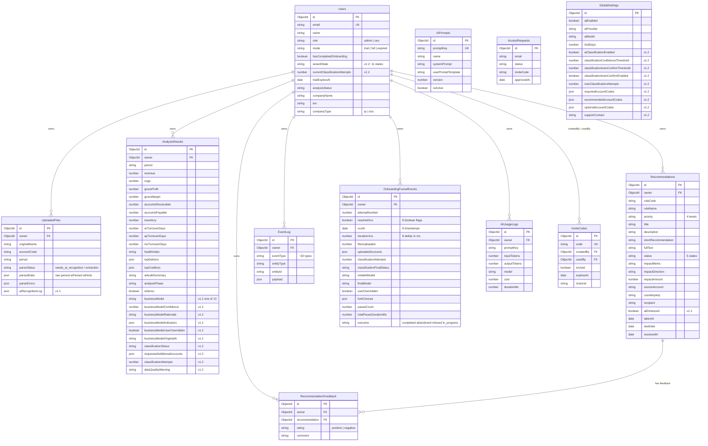
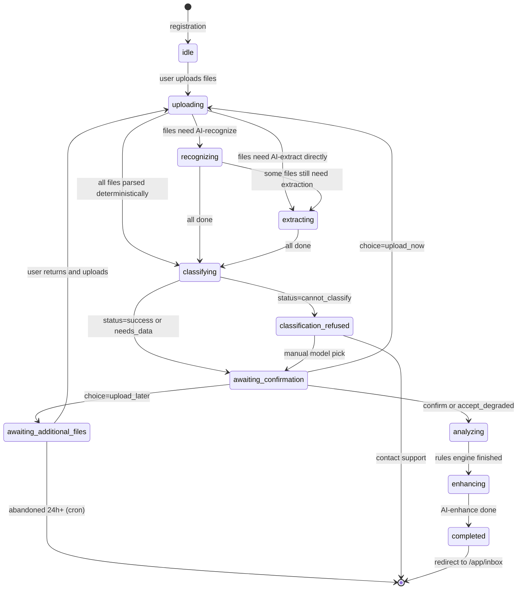
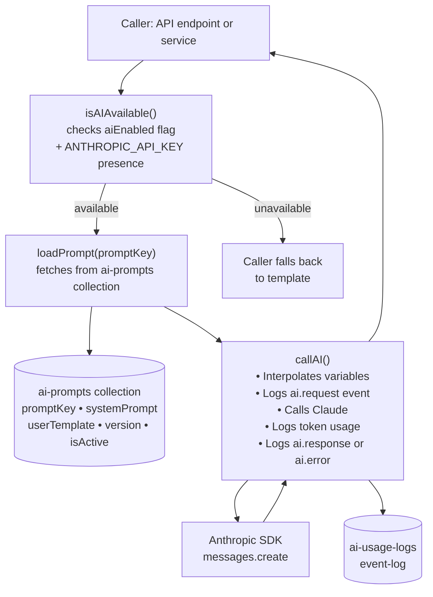
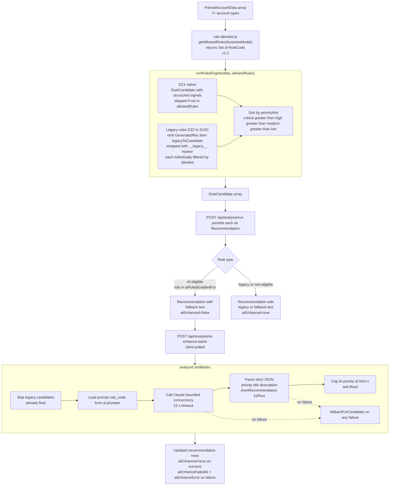
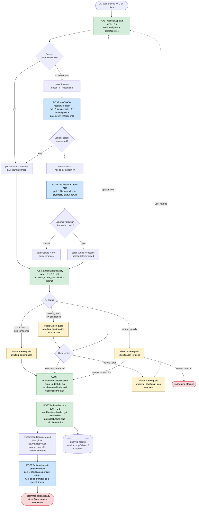

# MMLabs AI-Advisor — Product Architecture

**Document version:** 1.2
**Date:** May 4, 2026 (revised; original draft April 16, 2026)
**Audience:** Chief Technical Manager — detailed technical review
**Repository:** `mindme-labs/mm-agent`

**Revision history:**

- **v1.2 — 2026-05-04.** Documents v3.3.1 product spec (business model classification + adaptive onboarding). Updates Section 5 (new classification fields in `analysis-results`, new `wizardState` in `users`, new `onboarding-funnel-events` collection, new global settings), Section 6 (new endpoints for classification flow + admin funnel API), Section 7 (new onboarding screens + wizard state machine), Section 9 (new `business_model_classification` prompt + classification matrix in code), Section 10 (rule allowlist by business model), Section 11 (updated pipeline with classification stage + 3-way fork at low confidence), Section 13 (analytics layer: funnel events collection + admin dashboard).
- **v1.1 — 2026-04-25.** Documents shipped v4 (AI-augmented rules pipeline, pilot for `ДЗ-1`) and v5 (AI-based file transformation pipeline). Updates Sections 5 (collections), 6 (API endpoints + service layer), 9 (AI subsystem), 10 (rules engine — candidate-first contract), 11 (data pipeline — chunked client-polled flow). See `docs/dev-history.md` entries v4 and v5 for ship logs.
- **v1.0 — 2026-04-16.** Original draft generated from a direct analysis of the repository source code.

---

## Table of Contents

1. [Business Context](#1-business-context)
2. [High-Level Architecture](#2-high-level-architecture)
3. [Infrastructure & Deployment](#3-infrastructure--deployment)
4. [Technology Stack](#4-technology-stack)
5. [Data Model](#5-data-model)
6. [Backend Architecture](#6-backend-architecture)
7. [Frontend Architecture](#7-frontend-architecture)
8. [Authentication & Authorization](#8-authentication--authorization)
9. [AI Subsystem](#9-ai-subsystem)
10. [Rules Engine](#10-rules-engine)
11. [Data Pipeline](#11-data-pipeline)
12. [External Dependencies](#12-external-dependencies)
13. [Observability & Logging](#13-observability--logging)
14. [Security Considerations](#14-security-considerations)
15. [Known Limitations & Technical Debt](#15-known-limitations--technical-debt)

---

## 1. Business Context

### Product Overview

MMLabs AI-Advisor is a **proactive AI agent for working capital management** targeted at CEOs and owners of small-to-medium wholesale businesses in Russia. The product ingests financial reports from 1C:Accounting (the dominant ERP in Russia), runs a deterministic rules engine augmented by AI-powered analysis, and delivers prioritized, actionable recommendations — including ready-to-send business letters.

### Target User

- **Primary persona:** CEO / owner of a wholesale company with 10–200M RUB annual revenue.
- **Job to be done:** Identify working capital risks (overdue receivables, concentration, illiquid inventory, margin erosion) and act on them without deep financial expertise.

### Core Value Proposition

```
   1C Accounting Data (CSV)
            │
            ▼
   ┌─────────────────────┐
   │  Parse & Normalize   │
   └──────────┬──────────┘
              │
              ▼
   ┌─────────────────────┐     ┌───────────────────┐
   │  9 Deterministic     │────▶│ Recommendations    │
   │  Business Rules      │     │ (prioritized)      │
   └──────────┬──────────┘     └───────────────────┘
              │                         │
              ▼                         ▼
   ┌─────────────────────┐     ┌───────────────────┐
   │  Claude AI Audit     │────▶│ AI-Enhanced Texts  │
   │  (optional)          │     │ Ready-to-send      │
   └─────────────────────┘     │ letters & offers   │
                               └───────────────────┘
```

### Business Model

- **Trial mode:** 7-day free trial (configurable via admin panel), invite-code gated access.
- **Full mode:** Paid subscription (upgrade flow exists, payment integration TBD).

---

## 2. High-Level Architecture

The system is a **monolithic Next.js application** with an embedded Payload CMS for admin and data layer. All components — frontend, API, CMS admin, rules engine, AI orchestration — run within a single Node.js process.

```
┌────────────────────────────────────────────────────────────────────────┐
│                          Vercel Edge Network                          │
│                     (CDN, SSL, Auto-scaling)                          │
└────────────────────────────────┬───────────────────────────────────────┘
                                 │
                                 ▼
┌────────────────────────────────────────────────────────────────────────┐
│                        Next.js 16 Application                         │
│  ┌──────────────────────────────────────────────────────────────────┐ │
│  │                     Next.js Middleware                           │ │
│  │              (Auth guard for /app/* routes)                      │ │
│  └──────────────────────────────────────────────────────────────────┘ │
│                                                                       │
│  ┌─────────────────┐  ┌──────────────────┐  ┌─────────────────────┐  │
│  │   (frontend)     │  │   (payload)       │  │   /api/*            │  │
│  │   Route Group    │  │   Route Group     │  │   Custom REST       │  │
│  │                  │  │                   │  │   Endpoints          │  │
│  │  • Landing       │  │  • Admin UI       │  │                     │  │
│  │  • Auth pages    │  │    (/8ca90f70)    │  │  • Auth (login,     │  │
│  │  • App shell     │  │  • REST API       │  │    register, logout)│  │
│  │  • Inbox         │  │    (auto-gen)     │  │  • File upload      │  │
│  │  • Tasks         │  │  • GraphQL        │  │  • Analysis (run,   │  │
│  │  • Data          │  │    (auto-gen)     │  │    audit, enhance)  │  │
│  │  • Onboarding    │  │                   │  │  • Recommendations  │  │
│  │  • Upgrade       │  │                   │  │  • Events, feedback │  │
│  └─────────────────┘  └──────────────────┘  │  • Demo, dev helpers │  │
│                                              └─────────────────────┘  │
│  ┌──────────────────────────────────────────────────────────────────┐ │
│  │                       Service Layer (lib/)                       │ │
│  │  ┌────────────┐  ┌────────────┐  ┌──────────┐  ┌────────────┐  │ │
│  │  │  AI Client  │  │  Rules     │  │  Parser  │  │  Logger    │  │ │
│  │  │  & Audit    │  │  Engine    │  │  (OSV)   │  │            │  │ │
│  │  └──────┬─────┘  └────────────┘  └──────────┘  └────────────┘  │ │
│  │         │                                                        │ │
│  └─────────┼────────────────────────────────────────────────────────┘ │
│            │                                                          │
│  ┌─────────┼────────────────────────────────────────────────────────┐ │
│  │   Payload CMS Core (ORM, Access Control, Hooks)                 │ │
│  │         │                                                        │ │
│  └─────────┼────────────────────────────────────────────────────────┘ │
└────────────┼──────────────────────────────────────────────────────────┘
             │
             ▼
┌──────────────────────┐          ┌─────────────────────┐
│   MongoDB Atlas       │          │   Anthropic API     │
│   (Mongoose adapter)  │          │   (Claude Sonnet)   │
│                       │          │                     │
│   11 collections      │          │   6 default prompts │
│   1 global config     │          │   + per-rule prompts│
│                       │          │   Token-based       │
└──────────────────────┘          │   billing           │
                                   └─────────────────────┘
```

---

## 3. Infrastructure & Deployment

### Hosting

| Component | Provider | Details |
|-----------|----------|---------|
| Application | **Vercel** | Auto-deploy on push to `main`, serverless functions |
| Database | **MongoDB Atlas** | Cloud-managed MongoDB cluster |
| AI | **Anthropic API** | External API, pay-per-token |
| DNS/SSL | **Vercel** | Automatic SSL, edge routing |
| Image processing | **Sharp** | In-process, via `sharp` npm package |

### Deployment Pipeline

```
  Developer Push (main)
         │
         ▼
  ┌──────────────────┐
  │  Vercel Build     │
  │  • next build     │
  │  • Payload types  │
  │  • Import map gen │
  └────────┬─────────┘
           │
           ▼
  ┌──────────────────┐
  │  Serverless       │
  │  Functions        │
  │  (auto-scaled)    │
  └──────────────────┘
```

- **No Docker, Kubernetes, or Terraform** — the project relies entirely on Vercel's managed infrastructure.
- **No CI/CD pipeline files** in the repository (`.github/workflows` absent) — deployment is handled by Vercel's GitHub integration.
- **Build command:** `cross-env NODE_OPTIONS="--no-deprecation --max-old-space-size=8000" next build`

### Environment Variables

| Variable | Required | Purpose |
|----------|----------|---------|
| `MONGODB_URI` | Yes | MongoDB Atlas connection string |
| `PAYLOAD_SECRET` | Yes | JWT signing secret (min 32 chars) |
| `PAYLOAD_PUBLIC_SERVER_URL` | Yes | Application URL (used for CORS, CSRF, redirects) |
| `ANTHROPIC_API_KEY` | No | Anthropic Claude API key (AI features disabled without it) |
| `GOOGLE_CLIENT_ID` | No | Reserved for future Google OAuth (currently unused) |
| `GOOGLE_CLIENT_SECRET` | No | Reserved for future Google OAuth (currently unused) |

---

## 4. Technology Stack

### Runtime & Framework

| Layer | Technology | Version |
|-------|-----------|---------|
| Runtime | Node.js | ^18.20.2 \|\| >=20.9.0 |
| Framework | Next.js (App Router) | ^16.2.2 |
| Language | TypeScript | ^5.7.3 |
| Module system | ESM (`"type": "module"`) | — |

### Backend

| Component | Technology | Version |
|-----------|-----------|---------|
| CMS / ORM | Payload CMS | ^3.81.0 |
| Database adapter | `@payloadcms/db-mongodb` (Mongoose) | ^3.81.0 |
| Rich text | `@payloadcms/richtext-lexical` | ^3.81.0 |
| Auth tokens | `jsonwebtoken` | ^9.0.3 |
| AI SDK | `@anthropic-ai/sdk` | ^0.89.0 |
| Image processing | `sharp` | ^0.34.2 |

### Frontend

| Component | Technology | Version |
|-----------|-----------|---------|
| UI library | React (Server Components) | ^19.1.0 |
| Styling | Tailwind CSS 4 | ^4.2.2 |
| Component library | shadcn/ui (Base Nova style) | ^4.1.2 |
| Icons | Lucide React | ^0.487.0 |
| Font | Inter (Google Fonts) | — |
| Theming | next-themes | ^0.4.6 |
| Toasts | Sonner | ^2.0.7 |
| State management | zustand (declared, not in use) | ^5.0.5 |

---

## 5. Data Model

### Entity Relationship Diagram



### Collections Summary

| Collection | Slug | Records owned by | Admin-only |
|------------|------|-----------------|------------|
| Users | `users` | — | R/U: self or admin; D: admin |
| Media | `media` | — | Payload upload collection |
| Uploaded Files | `uploaded-files` | User (owner) | No |
| Analysis Results | `analysis-results` | User (owner) | No |
| Recommendations | `recommendations` | User (owner) | No |
| Recommendation Feedback | `recommendation-feedback` | User (owner) | No |
| AI Prompts | `ai-prompts` | — | Yes (full CRUD) |
| AI Usage Logs | `ai-usage-logs` | User (owner) | Read: admin; Create: system |
| Event Log | `event-log` | User (owner) | Read: admin; Create: open |
| **Onboarding Funnel Events** | `onboarding-funnel-events` | User (owner) | Read: admin; Write: system |
| Invite Codes | `invite-codes` | — | Yes (full CRUD) |
| Access Requests | `access-requests` | — | Create: public; Read/Update: admin |


### Recommendations — fields added in v1.1 (AI rules pipeline)

| Field | Type | Purpose |
|-------|------|---------|
| `aiEnhanced` | `checkbox` (default `false`) | Becomes `true` only after a successful AI enhancement. AI-eligible rules are persisted with `false` and enhanced asynchronously by `/api/analysis/ai-enhance-batch`. Legacy rules and rules outside `aiRulesEnabledFor` are persisted with `true` and the fallback template's text. |
| `signals` | `json` | Structured per-rule data used as input to AI prompt variables (e.g. for `ДЗ-1`: `{ balance, consecutiveNoPayment, recentPayments, paymentRatio, penaltyAmount }`). Legacy candidates additionally store the precomputed text under `__legacy__: true` + `title/description/...`. |
| `aiEnhanceFailedAt` | `date` | Timestamp of the last failed AI enhancement; used as a 5-minute cooldown gate by the batch endpoint. |
| `aiEnhanceError` | `text` | Last AI error code: `ai_timeout_or_unavailable`, `ai_invalid_json`, or the underlying exception message. |

### UploadedFiles — fields added in v1.1 (AI file transformation pipeline)

| Field / Enum | Change | Purpose |
|--------------|--------|---------|
| `parseStatus` | New enum values `needs_ai_recognition`, `needs_ai_extraction` | Mark files awaiting AI fallback after deterministic parsing failed. |
| `parsedData` | Now structured: `{ raw, parsed?, aiParsed?, aiHints?, truncated?, truncatedAtBytes? }` | `parsed` = deterministic regex parse (preferred); `aiParsed` = full AI extraction (fallback); `aiHints` = AI-recognized accountCode/period/columnFormat. |
| `aiRecognitionLog` | New JSON array field | Append-only log of each `file_recognition` and `data_extraction` attempt, with `promptVersion`, `model`, `inputTokens`, `outputTokens`, `durationMs`, `inputBytes`, `success`, `error`, `rawResponse` (first 500 chars). |

### Globals — fields added in v1.1

| Global / Field | Default | Purpose |
|----------------|---------|---------|
| `global-settings.aiRulesEnabled` | `false` | Master switch for per-rule AI enhancement. |
| `global-settings.aiRulesEnabledFor` | `['ДЗ-1']` | Allowlist of rule codes eligible for AI. Other rules use static fallback templates even when the master switch is on. |
| `global-settings.aiRulesBatchSize` | `3` | Concurrency / batch size used by `/api/analysis/ai-enhance-batch` (Hobby: 2-3, Pro: 5-8). |
| `global-settings.aiFileExtractionEnabled` | `false` | Master switch for AI fallback in the upload pipeline. |
| `global-settings.aiFileExtractionMaxKB` | `100` | Hard cap on file size sent to `data_extraction`. Larger files are truncated with `parsedData.truncated=true`. |
| `global-settings.aiFileBatchSize` | `2` | Files per `/api/files/ai-recognize-batch` call. |

### Users — fields added in v1.2 (classification & wizard state machine)

| Field | Type | Purpose |
|-------|------|---------|
| `wizardState` | `select` enum | Current onboarding wizard state. Used by `/app/*` layout for routing. Values: `idle`, `uploading`, `recognizing`, `extracting`, `classifying`, `awaiting_confirmation`, `awaiting_additional_files`, `classification_refused`, `analyzing`, `enhancing`, `completed`. Default: `idle`. |
| `currentClassificationAttempts` | `number`, default `0` | Counter of classification iterations in the current onboarding (request additional data → re-classify cycle). Reset on `wizardState=completed`. Capped by `global-settings.maxClassificationAttempts`. |

### AnalysisResults — fields added in v1.2 (business model classification)

| Field | Type | Purpose |
|-------|------|---------|
| `businessModel` | `select` enum (13 models) | Final business model used to filter rules. Values: `project`, `trading`, `production`, `subscription`, `consulting`, `agency`, `project_trading`, `production_project`, `consulting_subscription`, `trading_agency`, `subscription_consulting`, `production_trading`, `clinic`. |
| `businessModelConfidence` | `number` (0-1) | AI confidence at the time of final determination. |
| `businessModelRationale` | `textarea` | Human-readable explanation shown to user ("why this model"). 2-4 bullet points. |
| `businessModelIndicators` | `json` | Computed values for the 7 matrix indicators. Schema: `{ inventory_balance_41, wip_balance_20, finished_goods_43, revenue_regularity_score, fot_share_in_cogs, agency_transit_share, account_26_destination, _missing: string[] }`. |
| `businessModelUserOverridden` | `checkbox`, default `false` | True if user changed the AI-determined model in the confirmation screen. |
| `businessModelOriginalAi` | `text`, optional | The model AI originally returned, before any user override. Kept for analytics. |
| `classificationStatus` | `select` enum | `success` (high confidence, confirmed), `degraded` (low confidence, user accepted without uploading more files), `refused_manual` (cannot_classify path → user picked manually), `disabled` (`aiClassificationEnabled=false`, defaulted to `trading`). |
| `requestedAdditionalAccounts` | `json` (string[]) | Accounts AI asked to upload in the last `needs_data` iteration. Used for the persistent banner on `/app/inbox` when classification ended in `degraded`. |
| `classificationAttempts` | `number` | Total number of classify cycles for this analysis result. |
| `dataQualityWarning` | `textarea`, optional | AI's warning about data quality artifacts ("looks like reseller-as-producer accounting") that influenced classification. Shown as yellow banner in the confirmation screen. |

### Globals — fields added in v1.2

| Global / Field | Default | Purpose |
|----------------|---------|---------|
| `global-settings.aiClassificationEnabled` | `true` | Master switch for AI business model classification. Off → stage skipped, default `trading`, all 9 rules apply. |
| `global-settings.classificationConfidenceThreshold` | `0.7` | Minimum confidence to qualify as `status='success'`. Below threshold → `status='needs_data'` (UI shows fork screen). |
| `global-settings.classificationAutoConfirmThreshold` | `0.85` | Confidence above which UI auto-confirms (3-second countdown) if `classificationAutoConfirmEnabled=true`. |
| `global-settings.classificationAutoConfirmEnabled` | `false` | When true, UI auto-advances on high confidence. Default: always require explicit confirmation. |
| `global-settings.maxClassificationAttempts` | `3` | After this many `needs_data` cycles, "continue without files" becomes the only available option. |
| `global-settings.supportContact` | `""` | Contact for "talk to consultant" on the `cannot_classify` screen (email or Telegram link). |
| `global-settings.requiredAccountCodes` | `['90.01','90.02','60','62','10','41','45']` | Accounts that must be uploaded before "Start analysis" is enabled. |
| `global-settings.recommendedAccountCodes` | `['26','20','43','76']` | Optional but recommended accounts. AI may request these via `requestedAccounts`. |
| `global-settings.optionalAccountCodes` | `['51']` | Truly optional accounts (e.g., bank statement for future liquidity analysis). |

### OnboardingFunnelEvents — new collection in v1.2

Aggregated record per onboarding attempt. One row per onboarding lifecycle. Used for the admin funnel dashboard. See `analytics-spec.md` §3.2 for full field reference.

| Field | Type | Purpose |
|-------|------|---------|
| `owner` | `relationship → users` | The user this onboarding belongs to. |
| `attemptNumber` | `number` | 1 for first onboarding, 2+ for re-onboardings (e.g., after migrations). |
| `reachedStart` / `reachedUpload` / `reachedMinimumSet` / `reachedRecommendedSet` / `reachedRecognition` / `reachedExtraction` / `reachedClassification` / `reachedConfirmation` / `reachedAnalysis` | `checkbox` | Funnel-step flags. Idempotent: only set to `true` once. |
| `startedAt` / `uploadStartedAt` / `minimumSetCompletedAt` / `recommendedSetCompletedAt` / `classificationStartedAt` / `classificationCompletedAt` / `confirmationCompletedAt` / `analysisCompletedAt` / `abandonedAt` | `date` | Timestamps for funnel steps. |
| `durationToUpload` / `durationUpload` / `durationRecognition` / `durationExtraction` / `durationClassification` / `durationConfirmation` / `durationAnalysis` / `durationTotal` | `number` (ms) | Computed durations. Filled at finalization. |
| `filesUploaded` | `number` | Total files uploaded during this onboarding. |
| `uploadedAccounts` | `json` (string[]) | Account codes that were successfully recognized. |
| `missingRequiredAccounts` / `missingRecommendedAccounts` | `json` (string[]) | Account codes that were never uploaded. |
| `classificationAttempts` | `number` | Total classify cycles during this onboarding. |
| `classificationFinalStatus` | `select` enum | `success` / `degraded` / `refused_manual` / `disabled`. |
| `initialAiModel` / `initialAiConfidence` | `text` / `number` | What AI returned on the very first classify call. |
| `finalModel` / `finalConfidence` | `text` / `number` | What ended up being used for analysis (after user override / degraded acceptance). |
| `userOverridden` | `checkbox` | True if user changed the AI-determined model. |
| `hasDataQualityWarning` | `checkbox` | True if any iteration returned a `dataQualityWarning`. |
| `requestedAccountsHistory` | `json` (string[][]) | Array per attempt: `[['43','76'], ['43']]` — what AI asked for on each iteration. |
| `forkChoices` | `json` (object[]) | User's choices in the fork screen: `[{attempt, choice, timestamp}, ...]`. |
| `pauseCount` | `number` | How many times this onboarding entered `awaiting_additional_files`. |
| `totalPauseDurationMs` | `number` | Cumulative time spent in pause across all entries. |
| `outcome` | `select` enum | `completed` / `abandoned` / `refused` / `in_progress`. |
| `recommendationsCreated` | `number` | Final recommendation count after analysis. |

**Maintenance.** A scheduled cron job (hourly) sweeps `outcome='in_progress'` records with `updatedAt < now - 24h`, sets `outcome='abandoned'`, fills `abandonedAt`, and emits `wizard.abandoned` to `event-log`.

**Access control:** Read by admins only. Write is system-only — performed by the backend helper `updateFunnelEvent(userId, patch)` which is invoked from event handlers. Users do not see their own funnel records.

### Globals — original fields

| Global | Slug | Purpose |
|--------|------|---------|
| Global Settings | `global-settings` | AI on/off toggle, AI provider, model name, trial duration (+ AI rules and file extraction flags above) |

---

## 6. Backend Architecture

### Route Structure

The application uses Next.js App Router with two route groups and a custom API layer:

```
src/app/
├── (frontend)/           ← User-facing pages (SSR + Server Components)
│   ├── layout.tsx        ← Root layout: Inter font, globals.css, metadata
│   ├── page.tsx          ← Landing / teaser page
│   ├── auth/
│   │   ├── login/        ← Email/password login
│   │   ├── register/     ← Invite-gated registration
│   │   └── request-access/
│   └── app/
│       ├── layout.tsx    ← Authenticated shell (sidebar, header, bottom nav)
│       ├── page.tsx      ← Dashboard redirect
│       ├── inbox/        ← New recommendations
│       ├── tasks/        ← In-progress / overdue items
│       ├── data/         ← Financial metrics overview
│       ├── onboarding/   ← File upload + analysis wizard
│       └── upgrade/      ← Subscription upgrade CTA
│
├── (payload)/            ← Payload CMS admin (auto-generated)
│   ├── 8ca90f70/         ← Obscured admin route
│   └── api/
│       ├── [...slug]/    ← REST API (GET/POST/PATCH/PUT/DELETE)
│       └── graphql/      ← GraphQL endpoint
│
├── api/                  ← Custom REST endpoints
│   ├── auth/             ← login, register, logout
│   ├── files/             ← upload, ai-recognize-batch (v1.1), ai-extract-next (v1.1), status (v1.1)
│   ├── analysis/         ← run, ai-audit, ai-enhance, ai-enhance-batch (v1.1), status,
│   │                       classify (v1.2), classification (v1.2), classification-state (v1.2)
│   ├── recommendations/  ← Status updates
│   ├── feedback          ← User feedback on recommendations
│   ├── events            ← Client-side analytics
│   ├── ai/               ← Status check, seed-prompts (with ?upsert flag)
│   ├── access-requests   ← Public access request
│   ├── invite-codes/     ← Validate invite
│   ├── onboarding/       ← Complete onboarding, resume (v1.2)
│   ├── admin/            ← v1.2: admin-only endpoints
│   │   └── funnel/       ← Onboarding funnel dashboard data + drill-down + export
│   ├── demo/             ← Seed/list/download demo data
│   └── dev/              ← Dev helpers (skip/reset onboarding, migrate-v3.3)
│
└── manifest.ts           ← PWA manifest
```

### API Endpoints Detail

| Method | Endpoint | Auth | Purpose |
|--------|----------|------|---------|
| POST | `/api/auth/login` | Public | Email/password login, sets JWT cookie |
| POST | `/api/auth/register` | Public | Creates user with invite code validation |
| POST | `/api/auth/logout` | Cookie | Clears cookie, logs event, redirects |
| POST | `/api/files/upload` | Cookie | Multipart upload. Tries `parseOSVFile` synchronously; on failure marks file `needs_ai_recognition` (if AI enabled) or `warning` (legacy). Returns `{ files, needsAi, aiAvailable }`. No AI calls — keeps under ~2 s. |
| POST | `/api/files/ai-recognize-batch` | Cookie | Pulls 2 files (configurable) with `parseStatus='needs_ai_recognition'`, runs `aiIdentifyFile` (5 s timeout) in parallel, retries `parseOSVFileWithHints`. Files that succeed move to `success`; files where the lenient parser still fails move to `needs_ai_extraction`. Returns `{ done, processed, recovered, failed, remaining }`. |
| POST | `/api/files/ai-extract-next` | Cookie | Picks oldest file with `parseStatus='needs_ai_extraction'`, runs `aiExtractData` (9 s timeout, files > `aiFileExtractionMaxKB` truncated), validates output against `ParsedAccountData` schema. Persists `parsedData.aiParsed` on success or marks `error`. |
| GET | `/api/files/status` | Cookie | Aggregate counts by `parseStatus` for client polling: `{ total, success, needsRecognition, needsExtraction, warning, failed, inProgress, done }`. |
| POST | `/api/analysis/run` | Cookie | Parses files (prefers `parsedData.parsed` → `parsedData.aiParsed` → re-parse), runs rules engine → `RuleCandidate[]`, persists each as a recommendation with `aiEnhanced=false` for AI-eligible candidates and `aiEnhanced=true` for legacy/disabled. Returns fast (~2 s) with `{ ok, analysisId, total, pendingAi, prefilled }`. |
| POST | `/api/analysis/ai-enhance-batch` | Cookie | Picks K pending recommendations (`aiEnhanced=false`), respects 5-minute cooldown via `aiEnhanceFailedAt`, calls `analyzeCandidates()` with bounded concurrency (15 s per-call timeout), updates each rec or stamps `aiEnhanceFailedAt`/`aiEnhanceError`. Returns `{ done, processed, failed, remaining }`. |
| POST | `/api/analysis/ai-audit` | Cookie | Runs Claude AI audit on latest analysis metrics (legacy, complementary to per-rule pipeline) |
| POST | `/api/analysis/ai-enhance` | Cookie | Enhances one recommendation at a time with AI (legacy single-rec endpoint, retained for compatibility) |
| GET | `/api/analysis/status` | Cookie | Returns `{ phase, analysisId, total, enhanced, remaining, failed, done, wizardState }` for client polling. v1.2: includes `wizardState` for state-machine routing decisions. |
| POST | `/api/analysis/classify` | Cookie | **v1.2.** Reads `parsedData` from all completed files, calls Claude with `business_model_classification` prompt (4 s timeout, ~3-5 s typical). Creates draft `analysis-results` with classification fields. Updates `users.wizardState` based on AI response status (`success` → `awaiting_confirmation`; `needs_data` → `awaiting_confirmation` (best-guess + UI shows fork); `cannot_classify` → `classification_refused`). Increments `currentClassificationAttempts`. Returns `{ status, model?, confidence?, rationale, indicators, requestedAccounts?, dataQualityWarning?, attempt }`. |
| PATCH | `/api/analysis/classification` | Cookie | **v1.2.** User confirms or changes the model. Body: `{ model, isOverride: bool, acceptDegraded: bool, choice?: 'upload_now'\|'upload_later'\|'continue_degraded' }`. Sets `analysis-results.businessModel` + `classificationStatus` (`success` / `degraded` / `refused_manual`). Transitions `users.wizardState` to `analyzing` (confirm or accept-degraded path) or `awaiting_additional_files` (`choice='upload_later'`). Returns `{ ok, status, nextStage }`. |
| POST | `/api/analysis/refuse-classification` | Cookie | **v1.2.** User accepted the `cannot_classify` outcome and chose to contact support instead. Logs `classification.refused_contact_requested`, leaves `wizardState='classification_refused'`. Does not start analysis. |
| GET | `/api/analysis/classification-state` | Cookie | **v1.2.** Returns the current classification state for the user's draft analysis-results: `{ status, model?, confidence?, rationale, indicators, requestedAccounts?, dataQualityWarning?, attempt, wizardState }`. Used by the wizard UI for polling and re-rendering after page reload. |
| GET | `/api/ai/status` | Cookie | Checks if AI is available (API key + admin toggle) |
| POST | `/api/ai/seed-prompts` | Admin | Seeds default AI prompts into database. Accepts `?upsert=true` to overwrite existing prompts and bump `version` (used to roll out v2 of `file_recognition`/`data_extraction` and per-rule prompts; in v1.2 also seeds `business_model_classification`). |
| PATCH | `/api/recommendations/[id]/status` | Cookie | Updates recommendation status, sets timestamps |
| POST | `/api/feedback` | Cookie | Creates recommendation feedback |
| POST | `/api/events` | Cookie | Logs whitelisted client-side analytics events |
| POST | `/api/access-requests` | Public | Submits email for access |
| GET | `/api/invite-codes/validate` | Public | Validates invite code |
| POST | `/api/onboarding/complete` | Cookie | Marks onboarding as complete |
| GET | `/api/admin/funnel/overview` | Admin | **v1.2.** Aggregated funnel data for the admin dashboard. Query params: `period` (`today` / `7d` / `30d` / `custom`), `mode`, `classificationStatus`, `completedOnly`. Returns aggregates across 6 dashboard blocks (funnel steps, fork analysis, models, override pairs, durations, cohorts). See `analytics-spec.md` §5.1 for response shape. |
| GET | `/api/admin/funnel/users` | Admin | **v1.2.** Drill-down for the funnel dashboard. Returns the list of users who **did not** complete a given step. Query params: `step`, `completed=false`, `period`. |
| GET | `/api/admin/funnel/export` | Admin | **v1.2.** Streams `onboarding-funnel-events` for the period as CSV. |
| POST | `/api/demo/seed` | Cookie | Seeds demo data for current user |
| GET | `/api/demo/files` | Cookie | Lists available demo CSV files |
| GET | `/api/demo/files/download` | Cookie | Downloads a specific demo CSV |
| POST | `/api/dev/skip-onboarding` | Cookie | Dev only: skip onboarding |
| POST | `/api/dev/reset-onboarding` | Cookie | Dev only: clear demo data and reset |
| POST | `/api/dev/migrate-v3.3` | Admin | **v1.2.** Migration script for the v3.3.1 schema rollout: resets `hasCompletedOnboarding=false` for all users, deletes their stale `analysis-results` and `recommendations` (no real production users yet, so this is safe). Idempotent. Available in `dev` and `staging` only. |

### Service Layer

The backend does not follow a separate services directory pattern. Instead, domain logic is organized under `src/lib/` and invoked directly from API route handlers:

```
src/lib/
├── auth.ts                    ← JWT generation, cookie management, getCurrentUser
├── logger.ts                  ← Event logging to event-log collection
├── demo.ts                    ← Demo data seeding and cleanup
├── utils.ts                   ← Shared utilities
├── ai/
│   ├── client.ts              ← Anthropic SDK wrapper, prompt loading, usage logging.
│   │                            Returns { text, inputTokens, outputTokens, model, promptVersion, durationMs }
│   ├── audit.ts               ← Legacy AI audit orchestration (metrics → Claude → recommendations)
│   ├── prompts.ts             ← DEFAULT_PROMPTS — seed for `file_recognition`, `data_extraction`,
│   │                            `recommendation_text`, `enhance_recommendation`, `audit_working_capital`
│   ├── rule-prompts.ts        ← v1.1: RULE_PROMPTS — per-rule prompts (`rule_dz1`, …),
│   │                            promptKeyForRule(ruleCode) helper
│   ├── rule-analyzer.ts       ← v1.1: analyzeCandidates() — converts RuleCandidate[] to
│   │                            AnalyzedRecommendation[] with bounded concurrency, 15 s per-call
│   │                            timeout, JSON validation, priority capping (+1 max above hint),
│   │                            graceful fallback to fallback-templates
│   └── file-extractor.ts      ← v1.1: aiIdentifyFile (5 s timeout) + aiExtractData (9 s timeout,
│                                with truncation), both wrap callAI and report
│                                promptVersion/model/inputTokens/outputTokens for observability
├── parser/
│   ├── osv-parser.ts          ← 1C OSV CSV parser (7-col and 8-col formats)
│   ├── lenient-parser.ts      ← v1.1: parseOSVFileWithHints() — preamble-tolerant variant,
│   │                            bypasses the strict first-line regex when AI hints are available
│   └── validate.ts            ← v1.1: validateParsedAccountData() — schema + numeric sanity
│                                check (totals vs sum of entities, ±5%, supported account codes)
├── classification/            ← v1.2: business model classification subsystem
│   ├── matrix.ts              ← TypeScript object encoding the 13 models × 7 indicators matrix.
│   │                            Source of truth for the classification AI prompt. Each entry
│   │                            specifies indicator strength (strong/moderate/weak) and human-
│   │                            readable description. Updates here propagate to the prompt
│   │                            without code changes elsewhere.
│   ├── rule-allowlist.ts      ← Maps each businessModel to a Set<RuleCode>. Imported by
│   │                            /api/analysis/run before invoking the rules engine.
│   │                            Hybrids = union of base models. Defaults to all 9 rules
│   │                            (trading) when classification is disabled or unknown.
│   ├── classifier.ts          ← classify(parsedData[]) → ClassificationResult.
│   │                            Wraps callAI with the business_model_classification prompt,
│   │                            4 s timeout, JSON validation, confidence-floor enforcement
│   │                            (≥4 indicators required for confidence > 0.6).
│   └── service.ts             ← runClassification(userId), confirmClassification(userId, model),
│                                acceptDegraded(userId), refuseClassification(userId).
│                                Also coordinates wizardState transitions and funnel-event
│                                updates.
├── funnel/                    ← v1.2: onboarding funnel analytics
│   ├── update-event.ts        ← updateFunnelEvent(userId, patch) — idempotent helper that
│   │                            merges into the user's current onboarding-funnel-events record.
│   │                            Sets `reachedXxx` flags only on first observation.
│   ├── compute-durations.ts   ← Fills durationXxx fields when an onboarding finalizes.
│   └── abandoned-sweep.ts     ← Hourly cron job (Vercel scheduled function or external trigger)
│                                that finalizes stale `in_progress` records as `abandoned`.
└── rules/
    ├── engine.ts              ← Orchestrates 9 rules, returns RuleCandidate[] (v1.1).
    │                            Wraps legacy rules in synthetic candidates with __legacy__ marker
    │                            so the analyzer routes them straight to fallback.
    ├── metrics.ts             ← Calculates financial metrics from parsed data
    ├── templates.ts           ← Legacy templates module (still used by un-migrated rules)
    ├── fallback-templates.ts  ← v1.1: fallbackForCandidate() registry — pure functions producing
    │                            static recommendations from candidates (failsafe path)
    ├── dz1-*.ts               ← Overdue receivables (migrated to RuleCandidate contract)
    ├── dz2-*.ts               ← Debtor concentration risk (legacy contract)
    ├── dz3-*.ts               ← Customer churn detection (legacy contract)
    ├── kz1-*.ts               ← Unclosed supplier advances (legacy contract)
    ├── zap1-*.ts              ← Illiquid inventory (legacy contract)
    ├── zap2-*.ts              ← Excess inventory (legacy contract)
    ├── pl1-*.ts               ← Margin decline (legacy contract)
    ├── fc1-*.ts               ← Payment cycle imbalance (legacy contract)
    └── svs1-*.ts              ← Data quality issues (legacy contract)
```

---

## 7. Frontend Architecture

### Design Principles

- **Server Components by default** — layouts and pages use `async` functions with direct Payload queries.
- **Mobile-first, responsive** — bottom navigation on mobile, sidebar on desktop.
- **PWA-capable** — includes web manifest, standalone display mode, installable icons.
- **Russian-language UI** — all user-facing labels and content are in Russian.

### Page Structure

```
┌─────────────────────────────────────────────────────────────┐
│  AppHeader (company name, user avatar)                       │
├───────────────┬─────────────────────────────────────────────┤
│               │                                              │
│  Sidebar      │  Main Content Area                           │
│  (desktop)    │                                              │
│               │  ┌─────────────────────────────────┐        │
│  • Inbox      │  │  Inbox: recommendation cards     │        │
│  • Tasks      │  │  Tasks: in-progress items        │        │
│  • Data       │  │  Data: financial metrics          │        │
│  • Upgrade    │  │  Onboarding: file upload wizard   │        │
│               │  └─────────────────────────────────┘        │
│               │                                              │
├───────────────┴─────────────────────────────────────────────┤
│  BottomNav (mobile: inbox, tasks, data, settings)            │
└─────────────────────────────────────────────────────────────┘
```

### Onboarding wizard routes (v1.2)

The onboarding flow lives at `/app/onboarding/*` and is driven by `users.wizardState`. The `(frontend)/app/layout.tsx` redirects authenticated users to the appropriate sub-route based on state:

| `wizardState` | Redirect target | Screen contents |
|---|---|---|
| `idle` | `/app` | Welcome / "How it works" carousel |
| `uploading`, `recognizing`, `extracting`, `classifying`, `analyzing`, `enhancing` | `/app/onboarding` | Linear progress wizard with stage indicators |
| `awaiting_confirmation` (success/needs_data with best-guess) | `/app/onboarding` (mode=confirm or mode=fork) | Classification confirmation screen or fork screen, depending on AI status |
| `awaiting_additional_files` | `/app/onboarding/resume` | Pause screen — file picker for requested accounts + "Continue without files" option |
| `classification_refused` | `/app/onboarding/refused` | Refusal screen with manual model picker + "Contact support" |
| `completed` | `/app/inbox` | Standard app shell |

Each onboarding screen is a Client Component that polls `/api/analysis/classification-state` (every 2 s during AI calls) and reacts to state transitions.

**Wizard state machine** (`users.wizardState` field — drives routing in `(frontend)/app/layout.tsx`):



### Admin pages (v1.2)

| Route | Purpose |
|---|---|
| `/admin/funnel` | Custom Payload Admin page with the onboarding funnel dashboard. Six blocks (funnel steps, fork analysis, models, override pairs, durations, cohorts). Uses Recharts for visualizations. Calls `/api/admin/funnel/*` endpoints. See `analytics-spec.md` §4 for full layout. |

### Component Organization

```
src/components/
├── ui/                  ← shadcn/ui primitives (Button, Card, Dialog, etc.)
├── Sidebar.tsx          ← Desktop navigation
├── AppHeader.tsx        ← Top bar with user info
├── BottomNav.tsx        ← Mobile bottom navigation
├── admin/
│   └── SeedPromptsButton.tsx  ← Payload admin custom component
└── [domain components]  ← Recommendation cards, file upload, metrics display
```

### State Management

- **Server state:** Fetched via Payload queries in Server Components (no REST calls from server).
- **Client state:** React hooks + `fetch()` to `/api/*` endpoints.
- **Note:** `zustand` is declared as a dependency but has no imports in the codebase — it may be planned for future client-side state.

---

## 8. Authentication & Authorization

### Authentication Flow

```
┌──────────┐    POST /api/auth/register     ┌──────────────┐
│  Browser  │──────────────────────────────▶│  API Route    │
│           │  { email, password,            │               │
│           │    inviteCode? }               │  1. Validate invite code
│           │                                │  2. payload.create(users)
│           │◀──────────────────────────────│  3. jwt.sign({id, email})
│           │    Set-Cookie: payload-token   │  4. setAuthCookie()
└──────────┘    (httpOnly, secure, 30d)      └──────────────┘

┌──────────┐    POST /api/auth/login        ┌──────────────┐
│  Browser  │──────────────────────────────▶│  API Route    │
│           │  { email, password }           │               │
│           │                                │  1. payload.login()
│           │◀──────────────────────────────│  2. generatePayloadToken()
│           │    Set-Cookie: payload-token   │  3. setAuthCookie()
└──────────┘                                 └──────────────┘

┌──────────┐    GET /app/*                  ┌──────────────┐
│  Browser  │──────────────────────────────▶│  Middleware    │
│           │                                │               │
│           │  Cookie: payload-token?        │  • No cookie → redirect /auth/login
│           │                                │  • Has cookie → pass through
│           │                                │               │
│           │                                │  Layout:       │
│           │                                │  • getCurrentUser() verifies JWT
│           │                                │  • Expired trial → upgrade page
│           │                                │  • No onboarding → onboarding only
└──────────┘                                 └──────────────┘
```

### Token Details

- **Algorithm:** HS256 (via `jsonwebtoken`)
- **Secret:** `PAYLOAD_SECRET` environment variable
- **Payload:** `{ id, collection: 'users', email }`
- **Expiry:** 30 days
- **Cookie:** `payload-token`, `httpOnly`, `secure` (prod), `sameSite: lax`, `path: /`

### Authorization Model

| Level | Mechanism |
|-------|-----------|
| Route protection | Next.js middleware: checks `payload-token` cookie for `/app/*` |
| Page-level | Server Component layout: `getCurrentUser()` + redirect logic |
| API-level | Each route handler calls `getCurrentUser()` and returns 401 if null |
| Data-level | Payload access control: `ownerOrAdmin` pattern on most collections |
| Admin panel | Payload CMS built-in auth at `/8ca90f70`, requires `role: 'admin'` |

### Access Control Pattern

Most collections implement the same `ownerOrAdmin` pattern:

```typescript
const ownerOrAdmin = ({ req: { user } }) => {
  if (!user) return false
  if (user.role === 'admin') return true
  return { owner: { equals: user.id } }  // Payload query constraint
}
```

This ensures users can only read/update their own records while admins have full access.

---

## 9. AI Subsystem

### Architecture

The AI subsystem is designed with a **graceful degradation pattern** — the product functions fully without AI using the deterministic rules engine, and AI augments the experience when available.



### AI Prompt Registry

Prompts are stored in the database (`ai-prompts` collection) and managed via the admin panel. Two seed groups: `DEFAULT_PROMPTS` (in `src/lib/ai/prompts.ts`) and `RULE_PROMPTS` (in `src/lib/ai/rule-prompts.ts`). Both are seeded by `POST /api/ai/seed-prompts`; pass `?upsert=true` to overwrite existing entries and bump `version`.

| Prompt Key | Version | Purpose | Used By |
|-----------|---------|---------|---------|
| `file_recognition` | 2 | Extract `accountCode`, `period`, `documentType`, `columnFormat` (`'7-col'\|'8-col'\|'unknown'`) from the first 50 lines of a CSV | `aiIdentifyFile()` → `/api/files/ai-recognize-batch` |
| `data_extraction` | 2 | Extract full `ParsedAccountData` JSON from raw CSV (with strict schema, numeric/format rules) | `aiExtractData()` → `/api/files/ai-extract-next` |
| `business_model_classification` | 1 (v1.2) | Classify the user's business as one of 13 models on the matrix. Receives the matrix definition in the system prompt and aggregated `ParsedAccountData` from all uploaded files. Returns `{status, model?, confidence?, rationale, indicators, requestedAccounts?, dataQualityWarning?}`. Always returns a `model` value as best-guess except when `status='cannot_classify'`. | `classify()` → `/api/analysis/classify` |
| `recommendation_text` | 1 | Generate send-ready business letter | Legacy single-rec enhancement |
| `enhance_recommendation` | 1 | Rewrite rule output with CEO-grade context (`description`, `recommendation`, `draft`) | `/api/analysis/ai-enhance` |
| `audit_working_capital` | 1 | Generate 2-3 strategic AI-only recommendations | `/api/analysis/ai-audit` |
| `rule_dz1` | 1 | Per-rule prompt for `ДЗ-1` candidates — emits `{priority, title, description, shortRecommendation, fullText}` | `analyzeCandidates()` → `/api/analysis/ai-enhance-batch` |
| `rule_<code>` (reserved) | — | Slot for future per-rule prompts as the remaining 8 rules migrate to the candidate contract (`rule_dz2`, `rule_kz1`, …) | `analyzeCandidates()` |

### `business_model_classification` prompt internals (v1.2)

The system prompt embeds the full matrix from `src/lib/classification/matrix.ts` and asks the model to follow this chain-of-thought:

1. Compute the 7 indicators from the provided `ParsedAccountData`. Mark missing ones explicitly.
2. For each of the 13 models, compute a fit score: Σ(matched strong/moderate signals) − Σ(contradictions).
3. If max score >> 2nd score and indicators are complete → `status='success'`, confidence ≥ 0.7.
4. If the gap is small → `status='needs_data'`, populate `requestedAccounts` (≤3 specific accounts that would resolve the ambiguity), and **still fill `model`** as best-guess for the "continue without files" path.
5. If signals look like a hybrid but don't form a coherent business story → return the base model + `dataQualityWarning` explaining the suspected accounting artifact ("resale recorded through 20 as production").
6. If 4+ conflicting signals or out-of-ICP → `status='cannot_classify'`.

**Confidence floor enforcement.** The system prompt instructs the model to lower confidence by 0.10-0.15 per missing indicator (out of 7), and to never return confidence > 0.6 if fewer than 4 indicators are available. The classifier service (`src/lib/classification/classifier.ts`) additionally enforces this floor as a defense-in-depth check after parsing the AI response.

### Chunked Client-Polled Pattern (Vercel Hobby Compatible)

Both v1.1 pipelines (rules and file extraction) follow the same shape: a **fast synchronous endpoint** persists work, then the **client polls a batch endpoint** that performs a small amount of AI work per call (each call ≤ 9 s to fit within Vercel Hobby's 10 s function timeout).

```
                Synchronous endpoint              Client-polled batch endpoint
                ───────────────────               ─────────────────────────────
File pipeline:  POST /api/files/upload            POST /api/files/ai-recognize-batch (2/call)
                  ~2 s (no AI)                    POST /api/files/ai-extract-next   (1/call)
                                                  GET  /api/files/status            (counts)

Classify v1.2:  POST /api/analysis/classify       (sync, ≤5 s; 1 AI call inside)
                PATCH /api/analysis/classification (sync, <500 ms; DB only)
                GET   /api/analysis/classification-state (state polling for UI)

Rules pipeline: POST /api/analysis/run            POST /api/analysis/ai-enhance-batch (3/call)
                  ~2 s (rules only)               GET  /api/analysis/status           (progress)
```

The onboarding wizard runs sequential stages, each polling its dedicated endpoint until `done: true` (or transitioning into a wait-state) before moving to the next:

```
Upload → AI-recognize batch → AI-extract next → AI-classify → confirmation/fork →
 (sync)   (poll, 6 s/call)    (poll, 9 s/call)  (sync, 5 s)   (user input)
       → metrics+rules → AI-enhance batch → done
         (sync, 2 s)     (poll, 6-8 s/call)
```

The classification stage adds two state-machine branches:
- **`needs_data`** — wizard pauses on the fork screen. User chooses upload-now (re-enters the upload stage), upload-later (transitions to `awaiting_additional_files`, exit allowed), or continue-degraded (skips ahead to metrics+rules).
- **`cannot_classify`** — wizard transitions to `classification_refused` and shows the refusal screen with manual model picker.

Stages 1-2 are skipped when no files require AI (canonical 1C exports). The classification stage is skipped when `aiClassificationEnabled=false` (defaults to `trading`). The AI-enhance stage is skipped when AI is disabled or no recommendations are AI-eligible.

### AI Failure Modes & Fallback

Every AI integration point degrades gracefully:

| Failure | Detection | Fallback |
|---------|-----------|----------|
| `ANTHROPIC_API_KEY` missing | `getAnthropicClient()` returns null | `callAI()` returns null; downstream code uses static template |
| `aiEnabled` toggle off | `isAIAvailable()` returns false | Same as missing key |
| `aiRulesEnabled=false` | `loadAnalyzerSettings()` | Recommendations get fallback text, marked `aiEnhanced=true` immediately |
| `aiFileExtractionEnabled=false` | `loadFileExtractionSettings()` | Files keep legacy `parseStatus='warning'`; analysis runs on whatever parsed successfully |
| Per-call timeout (5/9/15 s) | `Promise.race` against `setTimeout` | Stamp `aiEnhanceFailedAt` (rules) or mark `parseStatus='error'` (files); fallback text persists |
| Malformed JSON response | Regex+`JSON.parse` + (for extraction) schema validation | Same as timeout |
| Anthropic rate limit / 5xx | Caught in `callAI` try/catch | Same as timeout |

For the rules pipeline, AI may downgrade priority freely but cannot raise it more than one level above the rule's `priorityHint` (capping in `analyzeCandidates`).

### AI Cost Tracking

Every AI call is logged to `ai-usage-logs` with:
- Token counts (input/output)
- Cost calculation: input at $3/M tokens, output at $15/M tokens
- Duration in milliseconds
- Model used

The file pipeline additionally logs each call to `uploaded-files.aiRecognitionLog` (per-file, append-only) with `promptVersion`, `model`, `inputTokens`, `outputTokens`, `durationMs`, `inputBytes`, `success`, `error`, and a `rawResponse` debug snippet (first 500 chars) — useful for forensic review of AI failures without needing to cross-reference `ai-usage-logs` and `event-log`.

### Default Model

`claude-sonnet-4-6` (configurable via `global-settings.aiModel` in admin panel).

---

## 10. Rules Engine

### Overview

The rules engine performs **deterministic candidate selection** in TypeScript and delegates **natural-language generation** either to AI (per-rule prompts) or to static fallback templates. Detection logic is fully synchronous, in-process, and dependency-free; only the text-generation step optionally hits the network.

**Migration state (v1.1):** the engine has switched its public contract from `GeneratedRecommendation[]` to `RuleCandidate[]`. Only `dz1-overdue-receivable.ts` has been migrated to natively emit candidates with structured `signals`; the remaining 8 rules still emit ready-to-persist recommendations and are wrapped by `legacyToCandidate()` in `engine.ts` with a `__legacy__` marker that routes them straight to the fallback path inside `analyzeCandidates()`. The engine therefore returns a uniform `RuleCandidate[]` regardless of per-rule migration status.

### Rules Catalog

| Code | Name | Domain | What It Detects |
|------|------|--------|-----------------|
| DZ1 | Overdue Receivables | Accounts Receivable | Counterparties with growing or stale debit balances |
| DZ2 | Debtor Concentration | Accounts Receivable | Single counterparty exceeding concentration threshold |
| DZ3 | Customer Churn | Accounts Receivable | Customers with declining or zero recent turnover |
| KZ1 | Unclosed Advances | Accounts Payable | Supplier advances (debit on account 60) not cleared |
| ZAP1 | Illiquid Inventory | Inventory | Stock items with no movement over the period |
| ZAP2 | Excess Inventory | Inventory | Inventory turnover days exceeding threshold |
| PL1 | Margin Decline | P&L | Gross margin below threshold or declining trend |
| FC1 | Payment Cycle Imbalance | Cash Flow | AR days significantly exceeding AP days |
| SVS1 | Data Quality | Cross-cutting | Missing accounts, zero balances, suspicious patterns |

### Processing Flow (v1.2)




### Financial Metrics

Calculated from 7 account types (1C chart of accounts):

| Metric | Source Accounts | Formula |
|--------|----------------|---------|
| Revenue | 90.01 | `turnoverCredit` |
| COGS | 90.02 | `turnoverDebit` |
| Gross Profit | — | `revenue - cogs` |
| Gross Margin | — | `(grossProfit / revenue) * 100` |
| Accounts Receivable | 62 | `closingDebit` |
| Accounts Payable | 60 | `closingCredit` |
| Inventory | 41 + 10 | `closingDebit (41) + closingDebit (10)` |
| Shipped Goods | 45 | `closingDebit` |
| AR Turnover Days | 62, 90.01 | `(avgAR / revenue) * 365` |
| AP Turnover Days | 60, 90.02 | `(avgAP / cogs) * 365` |
| Inventory Turnover | 41+10, 90.02 | `(avgInventory / cogs) * 365` |
| Health Index | — | AR/AP ratio: >1.2=fine, 0.8-1.2=issues, <0.8=risky |

---

## 11. Data Pipeline

### End-to-End Data Flow (v1.2)

The pipeline is organised as **deterministic-first, AI-fallback** in three places: file parsing (where AI recovers nonstandard headers/layouts), business model classification (where AI selects the relevant rule subset), and rule output (where AI enriches descriptions and drafts the user-facing letter). Each AI stage is driven by client polling so individual server calls fit within Vercel Hobby's 10 s function timeout.



**Legend.** Green nodes — synchronous one-shot endpoints. Blue — client-polled batch endpoints (each call fits in 10 s). Yellow — wizard wait-states (user input or pause). Red — terminal nodes.

**Key v1.2 additions** in this flow:
- **Classify stage** between file pipeline and `/api/analysis/run`. Always one AI call. `aiClassificationEnabled=false` skips the call, defaults businessModel to `trading`.
- **3-way fork** at `needs_data`: upload-now (re-enters pipeline), upload-later (pauses, user can leave and resume), continue-degraded (skips ahead with low-confidence model, marked `classificationStatus=degraded`).
- **State machine** drives layout routing: each rendered screen depends on `users.wizardState`.
- **Rule allowlist** filters which of the 9 rules run, based on the classified `businessModel`. See Section 10.

### Onboarding wizard stages (UI orchestration)

The onboarding wizard runs the full sequence as visible stages, hiding stages when their work is empty:

| # | Stage | Visible when | Endpoint | Wizard state |
|---|-------|--------------|----------|--------------|
| 1 | AI-распознавание файлов | `needs_ai_recognition` count > 0 | poll `/api/files/ai-recognize-batch` until done | `recognizing` |
| 2 | AI-извлечение данных | `needs_ai_extraction` count > 0 | poll `/api/files/ai-extract-next` until done | `extracting` |
| 3 | Определение типа бизнеса (v1.2) | `aiClassificationEnabled=true` | call `/api/analysis/classify` (sync, ~5 s) | `classifying` |
| 3a | Подтверждение модели (v1.2) | classification returned `success` or `needs_data` | UI screen, awaits user confirmation | `awaiting_confirmation` |
| 3b | Развилка дозагрузки (v1.2) | classification returned `needs_data` | UI screen with 3 choices | `awaiting_confirmation` (variant fork) |
| 3c | Пауза с возвратом (v1.2) | user chose `upload_later` | UI screen `/app/onboarding/resume` | `awaiting_additional_files` |
| 3d | Отказ от анализа (v1.2) | classification returned `cannot_classify` | UI screen `/app/onboarding/refused` | `classification_refused` |
| 4 | Расчёт метрик | always | inside `/api/analysis/run` | `analyzing` |
| 5 | Формирование рекомендаций | always | inside `/api/analysis/run` | `analyzing` |
| 6 | AI-анализ рекомендаций | `aiRulesEnabled=true` and any `pendingAi > 0` | poll `/api/analysis/ai-enhance-batch` until done | `enhancing` |

Demo mode (`/api/demo/seed`) skips stages 1-2 entirely (canonical demo data). Stage 3 still runs on demo data but is expected to return `trading` with high confidence on the canonical demo set.

### Supported File Types (1C OSV CSV)

| Account Code | Account Name (Russian) | CSV Format | Domain | Required (v1.2) |
|-------------|----------------------|------------|--------|-----------------|
| 62 | Расчёты с покупателями | 7-column | Receivables | Required |
| 60 | Расчёты с поставщиками | 7-column | Payables | Required |
| 41 | Товары | 8-column | Inventory | Required |
| 10 | Материалы | 8-column | Materials | Required |
| 45 | Товары отгруженные | 8-column | Shipped Goods | Required |
| 90.01 | Выручка | 7-column | Revenue | Required |
| 90.02 | Себестоимость продаж | 7-column | COGS | Required |
| 26 | Общехозяйственные расходы | 7-column | Overhead | Recommended (v1.2) |
| 20 | Основное производство | 7-column | WIP / production | Recommended (v1.2) |
| 43 | Готовая продукция | 8-column | Finished goods | Recommended (v1.2) |
| 76 | Расчёты с разными дебиторами/кредиторами | 7-column | Agency transit | Recommended (v1.2) |
| 51 | Расчётный счёт | 7-column | Bank balance | Optional (v1.2, future use) |

The `requiredAccountCodes`, `recommendedAccountCodes`, and `optionalAccountCodes` lists in `global-settings` (v1.2) make this configurable without redeployment.

---

## 12. External Dependencies

### Runtime External Services

```
┌────────────────────────────────────────────────────────────────────┐
│                        MMLabs Application                         │
│                                                                    │
│  ┌──────────────────┐  ┌──────────────────┐  ┌────────────────┐  │
│  │  Data Layer       │  │  AI Layer         │  │  Hosting       │  │
│  │                   │  │                   │  │                │  │
│  │  Payload CMS ─────│──│───────────────────│──│── Vercel       │  │
│  │  Mongoose ────────│──│───────────────────│──│──┐             │  │
│  └────────┬─────────┘  └────────┬─────────┘  │  │             │  │
│           │                      │            │  │             │  │
└───────────┼──────────────────────┼────────────┘  │             │  │
            │                      │               │             │  │
            ▼                      ▼               │             │  │
┌──────────────────┐  ┌──────────────────┐         │             │  │
│  MongoDB Atlas    │  │  Anthropic API   │         │             │  │
│                   │  │                  │         │             │  │
│  Provider: MongoDB│  │  Provider:       │         │             │  │
│  Protocol: mongodb│  │    Anthropic     │         │             │  │
│  +srv             │  │  Model: Claude   │         │             │  │
│  Auth: connection │  │    Sonnet 4.6    │         │             │  │
│    string         │  │  Auth: API key   │         │             │  │
│  SLA: Atlas tier- │  │  Billing: per-   │         │             │  │
│    dependent      │  │    token         │         │             │  │
│  Data residency:  │  │  Rate limits:    │         │             │  │
│    configurable   │  │    tier-dependent│         │             │  │
└──────────────────┘  └──────────────────┘         │             │  │
                                                    │             │  │
                                                    ▼             │  │
                                           ┌────────────────┐    │  │
                                           │  Vercel         │    │  │
                                           │                 │    │  │
                                           │  Hosting:       │    │  │
                                           │    Serverless   │    │  │
                                           │  CDN: Global    │    │  │
                                           │  SSL: Auto      │    │  │
                                           │  Deploy: Git    │    │  │
                                           │    push trigger │    │  │
                                           └────────────────┘    │  │
                                                                  │  │
└──────────────────────────────────────────────────────────────────┘  │
```

### Dependency Risk Assessment

| Dependency | Criticality | Failure Impact | Mitigation |
|-----------|-------------|---------------|------------|
| **MongoDB Atlas** | Critical | Full application down | None (single DB) |
| **Vercel** | Critical | Application inaccessible | None (single host) |
| **Anthropic Claude API** | Medium | AI features disabled, rules engine continues | Graceful fallback to deterministic rules |
| **npm registry** | Build-time only | Cannot deploy updates | Lock file ensures reproducibility |
| **Google Fonts (Inter)** | Low | Fallback to system font | Font loaded client-side with `next/font` |

### Future / Placeholder Dependencies

| Dependency | Status | Evidence |
|-----------|--------|---------|
| Google OAuth | Env vars defined, no implementation | `.env.example` has `GOOGLE_CLIENT_ID/SECRET` |
| OpenAI | Schema supports it, no client code | `GlobalSettings.aiProvider` has `'openai'` option |
| Payment provider | Upgrade page exists, no integration | `/app/upgrade/` route |

---

## 13. Observability & Logging

### Event Logging System

All significant user and system actions are logged to the `event-log` collection. Events are **append-only** (no update access) and visible only to admins.

| Event Type | Trigger |
|-----------|---------|
| `auth.login` | Successful login |
| `auth.logout` | Logout |
| `auth.registered` | New user registered |
| `access.request` | Public access request submitted |
| `access.approved` | Admin approved an access request |
| `invite.used` | Invite code redeemed during registration |
| `onboarding.started` (v1.2) | User opened `/app` for the first time |
| `onboarding.file_upload` | CSV file uploaded |
| `onboarding.minimum_set_complete` (v1.2) | All required accounts uploaded |
| `onboarding.analysis_started` | User clicked "Start analysis" |
| `onboarding.analysis_completed` | User reached `/inbox` |
| `file.recognition_started` / `file.recognition_completed` (v1.2) | AI file-recognition lifecycle |
| `file.extraction_started` / `file.extraction_completed` (v1.2) | AI file-extraction lifecycle |
| `file.parse_error` (v1.2) | Deterministic or AI parsing failed |
| `classification.started` (v1.2) | `/api/analysis/classify` invoked |
| `classification.completed` (v1.2) | AI returned a classification (any status) |
| `classification.confirmed` (v1.2) | User confirmed the model |
| `classification.user_override` (v1.2) | User changed the AI-determined model |
| `classification.additional_data_requested` (v1.2) | AI returned `needs_data` with specific accounts |
| `classification.user_choice` (v1.2) | User picked a fork option (`upload_now` / `upload_later` / `continue_degraded`) |
| `classification.degraded_accepted` (v1.2) | User accepted a low-confidence classification without uploading more files |
| `classification.refused_manual_override` (v1.2) | After `cannot_classify`, user picked a model manually |
| `classification.refused_contact_requested` (v1.2) | After `cannot_classify`, user chose to contact support |
| `wizard.state_changed` (v1.2) | Any `users.wizardState` transition |
| `wizard.paused` (v1.2) | Wizard moved to `awaiting_additional_files` |
| `wizard.resumed` (v1.2) | User came back from pause |
| `wizard.abandoned` (v1.2) | Cron-emitted: 24h+ idle in non-terminal state |
| `recommendation.status_changed` | Recommendation moved to new status |
| `recommendation.feedback` | User left feedback on recommendation |
| `recommendation.text_copied` | User copied recommendation text |
| `recommendation.viewed` | User opened recommendation detail |
| `recommendation.due_date_changed` | User changed due date |
| `task.overdue` | Background sweep marked a task as overdue |
| `ai.request` | AI API call initiated; payload includes `promptKey`, `promptVersion`, `model`, optional `stage` |
| `ai.response` | AI API call returned; payload includes token counts, `durationMs`, optional `stage` (`file_recognition` / `data_extraction` / `classification` / `rule_<code>`) |
| `ai.error` | AI API call failed or timed out; payload includes `error`, `promptKey`, optional `stage` |
| `ai.fallback` | AI unavailable, using rules only |
| `page.view` | Client-side page navigation |

The file pipeline writes a parallel per-file log to `uploaded-files.aiRecognitionLog` (see Section 5), useful for forensic review without joining `event-log` and `ai-usage-logs`.

### Onboarding Funnel Analytics (v1.2)

A separate **`onboarding-funnel-events` collection** stores one aggregated record per onboarding lifecycle (see Section 5). It is the primary data source for the admin funnel dashboard at `/admin/funnel`.

**Why a separate collection.** Building a funnel from raw `event-log` requires expensive aggregation per user (sort all events, compute deltas). The aggregated collection holds pre-computed flags and durations so the dashboard reads it directly without aggregation queries. The raw `event-log` is retained for forensic review.

**Update path:**

```
event handlers in API routes
        │
        ▼
updateFunnelEvent(userId, patch)  ← idempotent helper from src/lib/funnel/
        │
        ├─ creates record on first onboarding.started
        ├─ merges patch into existing record (only sets reachedXxx flags once)
        └─ on terminal events, fills durationXxx via compute-durations.ts
```

**Maintenance.** A scheduled cron job (Vercel scheduled function or external trigger) runs `abandoned-sweep.ts` hourly to finalize stale `in_progress` records as `abandoned` (24h+ idle).

**Dashboard.** A custom Payload Admin page at `/admin/funnel` renders six blocks: funnel steps, fork analysis (where users land in `needs_data`), model distribution, override pairs, processing durations (p50/p95/p99), and cohort retention. See `analytics-spec.md` for full layout, query specs, and dashboard endpoint contracts.

### AI Usage Tracking

Separate from event logs, the `ai-usage-logs` collection tracks:
- Per-call token consumption (input + output)
- Cost in USD
- Response latency
- Model version used
- Associated prompt key

### Console Logging

Server-side errors are logged via `console.error` / `console.warn` with prefixed tags:
- `[AI]` — AI client errors
- `[AI Audit]` — Audit parsing failures
- `[EventLog]` — Event logging failures
- `[Analysis]` — Analysis pipeline errors
- `[Demo]` — Demo seeding issues

**Note:** No structured logging framework (e.g., Pino, Winston) or external log aggregation service is currently configured.

---

## 14. Security Considerations

### Current Security Measures

| Area | Implementation |
|------|---------------|
| Authentication | JWT with HS256, httpOnly secure cookies, 30-day expiry |
| Authorization | Per-collection access control via Payload, owner-scoped queries |
| CORS | Restricted to `PAYLOAD_PUBLIC_SERVER_URL` only |
| CSRF | Configured in Payload config |
| Admin panel | Obscured route (`/8ca90f70`), admin role required |
| Secrets | Environment variables, never committed (`.gitignore` includes `.env`) |
| Robots | `noindex` meta tag on frontend pages |
| Input | CSV parsing uses deterministic regex, no `eval` |
| API keys | Anthropic key server-side only, never exposed to client |

### Areas Requiring Attention

| Concern | Current State | Recommendation |
|---------|--------------|----------------|
| Rate limiting | None on API routes | Add rate limiting (especially `/api/auth/login`, `/api/files/upload`) |
| Input validation | Minimal on API routes | Add Zod or similar validation schemas |
| Invite code brute-force | No attempt limiting | Add rate limiting on `/api/invite-codes/validate` |
| PAYLOAD_SECRET rotation | Static after deploy | Document rotation procedure |
| Admin route obscurity | Security through obscurity | Not a security boundary — add IP allowlisting or 2FA |
| Dev endpoints | `/api/dev/*` routes exist | Ensure disabled in production |
| File upload size | No explicit limit in code | Configure Vercel/Next.js body size limits |
| Dependency audit | No `npm audit` in CI | Add to build pipeline |

---

## 15. Known Limitations & Technical Debt

### Architecture

| Item | Description | Impact |
|------|-------------|--------|
| Monolithic deployment | All components in one process | Scaling constraints, single point of failure |
| No job queue / no background worker | AI work is split into ≤9 s chunks and driven by client polling instead of a queue. Works on Vercel Hobby but couples progress to the user's open tab — closing the browser mid-onboarding leaves recommendations with `aiEnhanced=false` and files with `parseStatus='needs_ai_*'` until next visit. | Wasted partial AI cost on abandoned sessions; no server-side retry of stuck items |
| No CI/CD pipeline | No test suite, no automated checks | Deployment risk |
| No caching layer | Every page load queries MongoDB | Performance under load |
| Zustand unused | Dependency declared but never imported | Dead dependency |
| Google OAuth placeholder | Env vars defined, no implementation | Incomplete feature |
| OpenAI placeholder | Schema supports it, no client code | Dead configuration path |

### Data

| Item | Description | Impact |
|------|-------------|--------|
| No database indexes defined | Relies on Payload/Mongoose defaults | Query performance at scale |
| JSON fields for complex data | `topDebtors`, `topCreditors`, `parsedData` | Cannot query or index efficiently |
| No data backup strategy | Relies on Atlas defaults | Data loss risk |
| No migration system | Payload handles schema evolution | May need explicit migrations for complex changes |

### Operations

| Item | Description | Impact |
|------|-------------|--------|
| No health check endpoint | Cannot verify app status programmatically | Monitoring gap |
| No structured logging | `console.error` only | Difficult debugging in production |
| No alerting | No integration with PagerDuty, Slack, etc. | Slow incident response |
| No performance monitoring | No APM tool configured | Blind to performance regressions |

---

*This document was generated from a direct analysis of the repository source code on April 16, 2026.*
