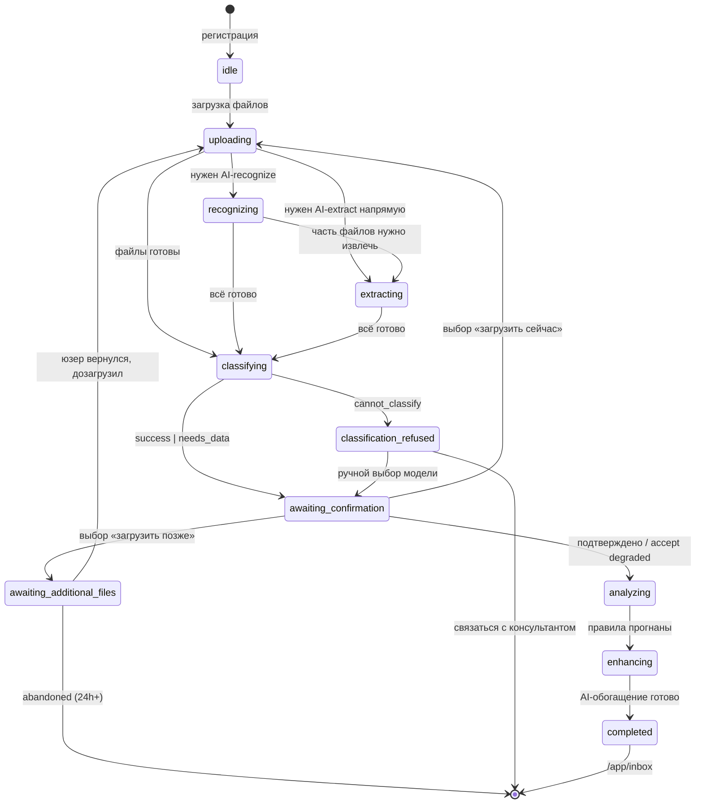
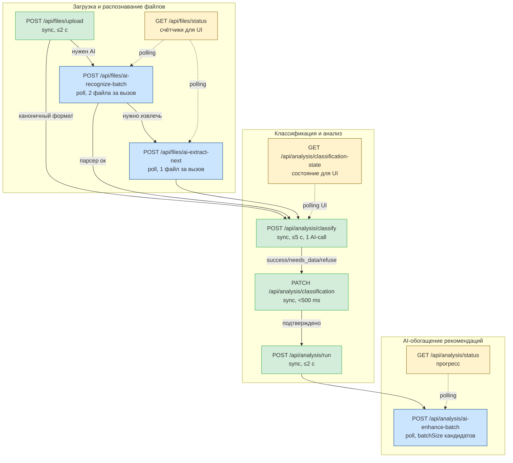

# MMLabs — Требования к продукту

> Самодостаточный документ с описанием целевого состояния продукта. История изменений и версионирование вынесены в `CHANGELOG.md`. Детальная спецификация аналитики — в `analytics-spec.md`. Архитектура и контракт для разработки — в `ARCHITECTURE.md`.

---

## 1. Контекст и общее описание

**MMLabs** — сервис для CEO малого и среднего бизнеса (выручка 50-500 млн ₽ в год), который автоматически находит проблемы оборотного капитала и предлагает готовые действия для их решения.

**Аудитория:** фаундеры и владельцы бизнеса, которые ведут учёт в 1С:Бухгалтерии и не имеют CFO в штате.

**Принцип работы:** клиент загружает выгрузки ОСВ из 1С → AI-классификатор определяет тип бизнеса по бухгалтерским индикаторам → rules engine применяет релевантные правила → AI-обогатитель формирует тексты рекомендаций и готовые черновики писем контрагентам.

**Принципиальное отличие от BI-систем:** клиент не строит дашборды — он получает готовые карточки «вот проблема, вот сумма, вот что делать, вот текст для отправки контрагенту».

---

## 2. Структура сервиса

| Компонент | Описание | Маршрут |
|---|---|---|
| Публичный тизер | Лендинг с описанием продукта и формой входа | `mmlabs.ru` |
| Личный кабинет | Основное приложение для CEO | `/app/*` |
| Административная панель | Payload CMS Admin UI для команды MMLabs | `/admin` |
| Сервис анализа файлов | Парсер ОСВ + AI-распознавание + AI-извлечение | внутренний |
| Сервис классификации бизнеса | AI-определение типа бизнеса по матрице моделей | внутренний |
| Rules engine + AI-обогатитель | Генерация рекомендаций | внутренний |
| Система логирования и аналитики | Сбор событий пользователя и метрик воронки | `/admin/funnel` |

Отдельные дополнительные сервисы (биллинг, интеграция с 1С через push, Telegram-уведомления) — за пределами текущего скоупа.

---

## 3. Пользовательский путь

### 3.1. Полная схема

```mermaid
flowchart TD
    Start([Юзер на mmlabs.ru])
    InvitePath{Есть инвайт-код?}
    Register[Регистрация: email + пароль]
    RequestAccess[Запрос доступа]
    AdminApprove[Админ одобряет]
    EmailWithCode[Email с инвайт-кодом]

    Start --> InvitePath
    InvitePath -->|да| Register
    InvitePath -->|нет| RequestAccess
    RequestAccess --> AdminApprove
    AdminApprove --> EmailWithCode
    EmailWithCode --> Register

    Register --> AppHome[/app: стартовый экран<br/>«Как это работает» + CTA/]
    AppHome --> Upload[Загрузка ОСВ:<br/>7 обязательных + до 4 рекомендуемых + 1 опц.]
    Upload --> AiPipeline[AI-recognize → AI-extract<br/>если файлы нестандартные]
    AiPipeline --> Classify[AI-classify:<br/>определение бизнес-модели]

    Classify --> Decision{Статус<br/>классификации}

    Decision -->|success| Confirm[Экран подтверждения<br/>модели]
    Decision -->|needs_data| Fork[Развилка: 3 варианта]
    Decision -->|cannot_classify| Refuse[Экран отказа<br/>+ ручной выбор]

    Fork -->|загрузить сейчас| Upload
    Fork -->|загрузить позже| Pause[Пауза wizard'а:<br/>awaiting_additional_files]
    Fork -->|продолжить без файлов| Degraded[Degraded:<br/>принимаем best-guess]

    Pause -.->|возврат позже| Upload

    Confirm --> Analysis[Расчёт метрик +<br/>правила фильтр по модели]
    Degraded --> Analysis
    Refuse -->|ручной выбор модели| Analysis
    Refuse -->|связаться| Stop([Конец онбординга])

    Analysis --> Enhance[AI-обогащение<br/>рекомендаций]
    Enhance --> Inbox[/app/inbox]

    classDef success fill:#d4edda,stroke:#28a745
    classDef warning fill:#fff3cd,stroke:#ffc107
    classDef danger fill:#f8d7da,stroke:#dc3545
    class Confirm,Analysis,Enhance,Inbox success
    class Fork,Pause,Degraded warning
    class Refuse,Stop danger
```

### 3.2. Состояния пользователя

| Состояние | Маршрут | Условие |
|---|---|---|
| Не авторизован | `mmlabs.ru` (тизер) | Нет cookie |
| Авторизован, первый визит | `/app` (стартовый экран) | `hasCompletedOnboarding=false` И `wizardState='idle'` |
| Анализ в процессе | `/app/onboarding` (визард) | `wizardState ∈ {uploading, recognizing, extracting, classifying, awaiting_confirmation, analyzing, enhancing}` |
| Wizard на паузе | `/app/onboarding/resume` | `wizardState='awaiting_additional_files'` |
| Отказ от анализа | `/app/onboarding/refused` | `wizardState='classification_refused'` |
| Анализ готов | `/app/inbox` | `hasCompletedOnboarding=true` |
| Повторный визит | `/app/inbox` | Сессия активна (30 дней) |

**Машина состояний онбординг-wizard'а** (поле `users.wizardState`):



### 3.3. Доступ

Сервис работает по приглашениям. Два пути регистрации:

1. **С инвайт-кодом.** Юзер ввёл код на `mmlabs.ru` → попадает на форму регистрации (email + пароль).
2. **По запросу.** Юзер заполнил форму запроса → email уведомление админу → админ одобряет в `/admin/access-requests` → автоматически высылается письмо с инвайт-кодом → юзер регистрируется.

Аутентификация — через Payload Auth (email/пароль), сессия 30 дней, JWT в httpOnly cookie.

---

## 4. Публичный тизер (`mmlabs.ru`)

Один-два экрана. Закрыт от индексации (`robots.txt` + `noindex`).

**Hero:** Заголовок с болью клиента, пример карточки рекомендации с реальными цифрами (демо), CTA-блок.

**CTA-блок:**
- Поле для инвайт-кода + кнопка «Получить доступ»
- Ссылка «Запросить доступ» (открывает форму)
- Ссылка «Войти» (для зарегистрированных)

**Прототипы:** `docs/prototype/teaser-landing.html`

---

## 5. Личный кабинет

### 5.1. Стартовый экран (`/app`)

Показывается при первом визите (`hasCompletedOnboarding=false` И `wizardState='idle'`).

**Содержимое:**
- Приветствие с именем юзера
- Карусель «Как это работает» — 4 шага: «Загрузите ОСВ» → «AI определит тип бизнеса» → «Найдём проблемы» → «Получите готовые письма для контрагентов»
- CTA «Загрузить файлы» — переход на экран загрузки (`/app/onboarding`)
- Справка по счетам — раскрываемый блок «Какие выгрузки нужны?» с инструкциями по 1С

**Прототипы:** `docs/prototype/start-mobile.html`, `docs/prototype/start-web.html`

### 5.2. Экран загрузки (`/app/onboarding`, шаг 1)

**Запрашиваемый набор счетов:**

| Группа | Счета | Поведение |
|---|---|---|
| Обязательные (7) | 90.01, 90.02, 60, 62, 10, 41, 45 | Без полного набора кнопка «Начать анализ» задизейблена. Подсказка: «Не хватает: счёт X» |
| Рекомендуемые (4) | 26, 20, 43, 76 | Помечены «повышают точность анализа». Не блокируют процесс — AI запросит при необходимости |
| Опциональный (1) | 51 | Только для будущего анализа ликвидности. Принимается если есть, не упоминается активно |

**UI экрана:**
- Список ожидаемых файлов сгруппирован по категориям с иконками статуса (загружен / не загружен / опционально)
- Текст подсказки: «Эти выгрузки нужны для определения типа вашего бизнеса и выявления проблем»
- Drag-n-drop зона + кнопка выбора файлов
- Ограничения: до 10 файлов, до 10 МБ суммарно, .csv или .xlsx
- Таблица распознавания файлов с прогрессом

После загрузки всех обязательных файлов кнопка «Начать анализ» активна → переход к стадии 2 (распознавание и извлечение).

### 5.3. Стадии анализа (`/app/onboarding`, шаг 2-N)

После старта анализа экран показывает прогресс по стадиям. Каждая стадия — отдельный AI или sync-вызов, поллится клиентом.

| Стадия | Видна когда | Подпись прогресса |
|---|---|---|
| 1. AI-распознавание файлов | Есть файлы со статусом `needs_ai_recognition` | «AI-распознавание файлов · X из Y» |
| 2. AI-извлечение данных | Есть файлы со статусом `needs_ai_extraction` | «AI-извлечение данных · X из Y» |
| 3. Классификация бизнеса | Всегда (если `aiClassificationEnabled=true`) | «Определяем тип вашего бизнеса» |
| 3.5. Подтверждение модели | Wizard паузится в `awaiting_confirmation` | (см. 5.4) |
| 4. Расчёт метрик | После подтверждения | «Считаем метрики компании» |
| 5. Правила (rules engine) | Всегда | «Формируем рекомендации» (фильтруются по модели) |
| 6. AI-обогащение рекомендаций | Если `aiRulesEnabled` и есть правила в `aiRulesEnabledFor` | «AI-анализ: X из Y» |

**Поведение скрытых стадий:**
- 1, 2 скрываются если все файлы прошли регулярный парсер.
- 3 пропускается если `aiClassificationEnabled=false` — модель по умолчанию `trading`.
- 6 скрывается если AI выключен или для всех кандидатов уже подставлен fallback-текст.

**Прототипы:** `docs/prototype/analysis-mobile.html`, `docs/prototype/analysis-web.html`

### 5.4. Экран подтверждения классификации

Появляется когда AI-classify вернул `status='success'` или после выбора «продолжить без файлов» из развилки (5.5).

**Структура:**

```
Тип вашего бизнеса
─────────────────────
[Название модели]
[Краткое описание]

Уверенность: 87%

▼ Почему мы так решили
• Большие остатки на счёте 41 (товары) — 12.3 млн ₽
• Низкая доля ФОТ в себестоимости — 4%
• Регулярные продажи без выраженной сезонности
• Нет остатков на 20 и 43 (нет производства)

▼ Изменить тип бизнеса
[Dropdown: 13 вариантов]

[Подтвердить и продолжить]
```

**Поведение:**
- При confidence ≥ `classificationAutoConfirmThreshold` (если включён `classificationAutoConfirmEnabled`) — countdown 3 сек и автопереход. Юзер может прервать.
- При меньшей уверенности — обязательное явное подтверждение.
- Если AI вернул `dataQualityWarning` — отдельный жёлтый блок с предупреждением о возможных проблемах учёта, повлиявших на классификацию.
- При смене модели через dropdown устанавливается `businessModelUserOverridden=true`.

### 5.5. Экран развилки при недостатке данных

Появляется когда AI-classify вернул `status='needs_data'` — best-guess модель есть, но уверенность ниже порога, и AI знает, какие именно счета помогут уточнить.

**Структура:**

```
Чтобы точнее определить тип вашего бизнеса
─────────────────────────────────────────
Похоже на пересечение торговой и производственной моделей.
Загрузка дополнительных выгрузок поможет понять точно.

Что бы помогло:
📄 ОСВ по счёту 43 «Готовая продукция»
   Покажет, есть ли у вас собственное производство

📄 ОСВ по счёту 76 «Расчёты с прочими…»
   Поможет отличить агентскую схему от обычной

Что вы хотите сделать?

◯ Загрузить сейчас
  Получим точную классификацию через 1-2 минуты

◯ Загружу позже
  Анализ возобновится при следующем заходе

◯ Продолжить без этих файлов
  Классифицируем на текущих данных. Уверенность будет ниже,
  мы вас об этом предупредим. Можно дозагрузить позже.

[Продолжить]
```

**Поведение трёх вариантов:**

| Вариант | Действие | Состояние wizard'а |
|---|---|---|
| Загрузить сейчас | Открывается file picker → upload → re-run pipeline | `uploading` → ... → `classifying` |
| Загрузить позже | Запоминаем `requestedAccounts`, юзер выходит | `awaiting_additional_files` |
| Продолжить без файлов | Принимаем best-guess как final | `awaiting_confirmation` (статус `degraded`) |

**Лимит итераций.** Параметр `maxClassificationAttempts` (default 3). После трёх неудачных циклов «загрузить ещё → всё ещё needs_data» вариант «продолжить без файлов» становится единственно доступным.

### 5.6. Экран degraded-классификации

Аналогичен 5.4, но с дополнительным предупреждением о неполных данных.

**Отличия от 5.4:**
- Жёлтая плашка вверху: «Классификация выполнена на неполных данных. Точность можно повысить, загрузив [список счетов]»
- Кнопка «Загрузить рекомендованные счета сейчас» (опциональная, ведёт в 5.5)
- В обосновании AI явно указано, какие индикаторы остались missing
- После запуска анализа — постоянный баннер на `/app/inbox`: «Анализ выполнен на неполных данных. Дозагрузите ОСВ по счёту X для повышения точности». Скрывается после дозагрузки или закрытия пользователем.

### 5.7. Экран отказа от классификации

Появляется когда AI вернул `status='cannot_classify'` (редкий случай — данные настолько противоречивы или компания вне ICP).

**Структура:**

```
Не удалось определить тип вашего бизнеса
─────────────────────────────────────────
По загруженным данным невозможно однозначно сказать,
какая у вас модель работы. Это бывает у компаний со
сложной структурой или у компаний вне нашей основной
экспертизы.

Что можно сделать:

• Связаться с MMLabs — поможем настроить аналитику
  под вашу специфику
  [Связаться с консультантом]

• Выбрать тип бизнеса вручную и продолжить
  (рекомендации могут быть менее точными)
  [Dropdown: 13 моделей]
  [Продолжить с выбранной моделью]
```

**Поведение:**
- «Связаться с консультантом» — открывает почту/Telegram (`global-settings.supportContact`). Wizard остаётся в `classification_refused`.
- «Продолжить с выбранной моделью» — `businessModelUserOverridden=true`, переход в `awaiting_confirmation` с маркером «ручной выбор после отказа AI».

### 5.8. Экран возврата к незавершённому анализу (`/app/onboarding/resume`)

Layout `/app/*` редиректит сюда, если `wizardState='awaiting_additional_files'`.

**Содержимое:**
- Приветственный текст: «Продолжим с того места, где остановились»
- Резюме предыдущей попытки: «Мы определили вашу модель как [предположение] с уверенностью [%]. Загрузите [список счетов], чтобы уточнить»
- Тот же UI что в 5.5 (file picker для рекомендованных счетов)
- Кнопка «Принять текущее предположение и продолжить анализ» — приводит к degraded-классификации (5.6)

### 5.9. Навигация

| Элемент | Mobile/Tablet | Desktop |
|---|---|---|
| Тип | Bottom nav | Sidebar 260px |
| Пункты | Входящие, Задачи, Данные | Те же + имя, выход |
| Бейджи | Кол-во новых (inbox), просроченных (tasks) | Те же |

### 5.10. Экран «Входящие» (`/app/inbox`)

Главный рабочий экран. Показывается после завершения онбординга.

**Финансовая сводка** (верх экрана):
- Выручка
- «Вам должны» (ДЗ)
- «Вы должны» (КЗ)
- Оборачиваемость ДЗ/КЗ в днях
- Валовая рентабельность %
- Health Index: 🟢 В норме / 🟡 Есть вопросы / 🔴 Риск

**Баннер задач** (если есть): «В работе 3 задачи на ₽8.3M · Просрочено 2 на ₽5.2M» со ссылкой на `/app/tasks`.

**Баннер просроченных** (если есть): красный, «2 задачи просрочены на ₽5.2M».

**Баннер degraded-классификации** (если был выбран этот режим): «Анализ выполнен на неполных данных. Дозагрузите ОСВ по счёту X для повышения точности».

**Лента рекомендаций.** Карточки в статусе `new`, сортировка по приоритету. Структура карточки:
- Приоритет (тонкий верхний border: красный/оранжевый/жёлтый) + слово в углу
- Заголовок (человеческий язык, без кодов правил)
- Сумма влияния
- Описание + рекомендация (два столбца на desktop)
- Действия: «Взять в работу», «Не сейчас», «Скопировать текст»
- Обратная связь: «Да · Нет · Написать отзыв» (текстом, без эмодзи)

**Прототипы:** `docs/prototype/inbox-mobile.html`, `docs/prototype/inbox-web.html`

### 5.11. Экран «Мои задачи» (`/app/tasks`)

Рабочий инструмент CEO для управления взятыми в работу задачами. Два представления: таблица и карточки.

**Суммарная сводка** (всегда видна):

| Метрика | Описание |
|---|---|
| В работе | Сумма `impactAmount` задач со статусом `in_progress` |
| Просрочено | Сумма задач, где `dueDate < сегодня` и статус `in_progress` или `stuck` |
| Решено | Сумма задач со статусом `resolved` |
| Всего задач | Общее количество (все статусы кроме `new`) |

**Баннер просроченных:** красный баннер с количеством и суммой.

**Табличное представление:**
- Колонки: Приоритет (border) | Сумма | Заголовок | Дата взятия | Срок | Просрочка | Статус (бейдж)
- Сортировка: просроченные сверху, затем по сроку. Кликабельная по сумме, по сроку, по статусу.
- Просроченные строки выделяются красным фоном.

**Карточное представление:**
- Карточки с приоритетом (верхний border), суммой, заголовком, метаданными, dropdown статуса.
- Desktop: сетка 2 колонки. Mobile: одна колонка.
- Просроченные карточки: левый красный border.

**Действия:**
- Сменить статус (dropdown): `in_progress`, `resolved`, `stuck`, `dismissed`
- Изменить срок выполнения (`dueDate`)
- Скопировать текст письма

**Прототипы:** `docs/prototype/tasks-mobile.html`, `docs/prototype/tasks-web.html`

### 5.12. Экран «Данные» (`/app/data`)

Информация о загруженных данных и расширенных метриках.

**Секции:**
- Загруженные файлы (таблица: имя, тип, счёт, период, статус)
- Ключевые метрики (выручка, себестоимость, ВП, рентабельность, ДЗ, КЗ, запасы, товары отгруженные)
- Топ-5 дебиторов (контрагент, сумма, доля от общей ДЗ — > 30% подсветка красным)
- Топ-5 кредиторов (контрагент, сумма, наличие авансов)

**Кнопка «Загрузить новые файлы»** — повторный анализ с актуальными данными.

### 5.13. Экран «Обновление тарифа» (`/app/upgrade`)

Будущий функционал. В MVP — описание полного тарифа и заблокированная кнопка «Выбрать слот для созвона».

### 5.14. Дизайн-система

| Параметр | Значение |
|---|---|
| Подход | Отдельная вёрстка для mobile и web |
| Mobile | max-width 430px, bottom nav, вертикальный стек |
| Web | sidebar 260px, контент до 920px, щедрые отступы |
| Фон | `#F8F7F4` |
| Карточки | `#FFFFFF`, border `#E0DDD6`, radius 12-14px |
| Акцент | `#0F7B5C` (green) |
| Текст | `#141414` (primary), `#3D3D3D` (secondary), `#888680` (muted) |
| Шрифт | Inter (Latin + Cyrillic), 400/500/600/700/800 |
| Заголовки web | 28-36px, letter-spacing -.02em |
| Заголовки mobile | 20-24px |
| Тело текста web | 15-16px |
| Тело текста mobile | 13-15px |
| Padding карточек web | 22-32px |
| Padding карточек mobile | 14-16px |
| Тач-таргеты | ≥ 44px |

**Цвета приоритетов:**
- Критично: `#C0392B` (red), фон `#FDF0EE`
- Высокий: `#B45309` (amber), фон `#FEF3C7`
- Средний: `#CA8A04` (yellow), фон `#FEFCE8`
- Низкий: `#888680` (gray)

**Принципы UI:**
- Без внутренних кодов (ДЗ-2, ЗАП-1) в пользовательском интерфейсе — только человеческий язык.
- Без иконок-эмодзи в обратной связи — текстовые ссылки.
- Приоритет обозначается тонким цветным border, не кричащими бейджами.
- Денежные суммы — крупным шрифтом, главный индикатор ценности.
- Просроченные элементы — красный фон строки/карточки, не отдельный бейдж.

---

## 6. Бизнес-модели и матрица классификации

Источник матрицы: `bizmodel_matrix_final.html`. Структура матрицы кодифицируется в коде как TypeScript-объект (`src/lib/classification/matrix.ts`). AI получает её в системном промпте.

### 6.1. Список из 13 моделей

| ID | Название | Категория | Краткое описание |
|---|---|---|---|
| `project` | Проектная | Базовая | Сделка = проект, директ-костинг, нерегулярная выручка |
| `trading` | Торговая | Базовая | Inventory-driven, оптовая B2B-дистрибуция |
| `production` | Производственная | Базовая | Manufacturing: материалы → НЗП → готовая продукция |
| `subscription` | Подписочная | Базовая | SaaS / сервис, равномерная регулярная выручка |
| `consulting` | Консалтинг | Базовая | Time-based услуги, ФОТ-доминирующий COGS |
| `agency` | Агентская | Базовая | Комиссионная модель, транзит выручки через 76/62 |
| `project_trading` | Проект + торговля | Гибрид | Интеграторы, строители (сделка-проект + закупка под неё) |
| `production_project` | Производство + проект | Гибрид | Под заказ, мебель (НЗП по конкретным заказам) |
| `consulting_subscription` | Консалтинг + подписка | Гибрид | Ретейнер + проекты (основа — услуги) |
| `trading_agency` | Торговля + агент | Гибрид | Свой товар + комиссия по чужому |
| `subscription_consulting` | SaaS + консалтинг | Гибрид | Подписка + внедрение (основа — продукт) |
| `production_trading` | Производство + торговля | Гибрид | Своё производство + перепродажа |
| `clinic` | Частная клиника | Отраслевой | Гибрид консалтинга и торговли с медицинской спецификой |

Случай 3+ моделей одновременно AI должен возвращать как `cannot_classify` — такие компании работают с консультантом MMLabs индивидуально.

### 6.2. Семь индикаторов матрицы

| Индикатор | Источник | Что показывает |
|---|---|---|
| Характер счёта 26 | Куда закрывается 26 (на 90 / 20 / 44) | Производственная vs торговая vs проектная |
| Аналитика по сделке | Аналитика на 90 / 62 | Проектная (по договору) vs торговая (по позиции) |
| Остатки склада | Дебет 41, 10 | Торговля / производство (есть) vs консалтинг / SaaS (нет) |
| НЗП / лаг | Остаток 20, лаг между закупкой и продажей | Производство (есть НЗП) vs торговля (только лаг) |
| Регулярность выручки | Дисперсия помесячных оборотов 90.01 | Подписка (равномерно) vs проектная (нерегулярно) |
| Доля зарплат | Кредит 70 / Дебет 90.02 | Консалтинг/SaaS (доминирует) vs торговля (низкая) |
| Транзит 76/62 | Обороты 76 относительно 62 | Агентская (высокий) vs остальные (нет) |

Каждый индикатор для каждой модели имеет силу: `strong` / `moderate` / `weak`. AI оценивает совместимость по сумме совпадений сильных/умеренных сигналов минус противоречия.

### 6.3. Концепция «артефакт мусора»

Иногда сигналы выглядят как реальный гибрид, но не складываются в логичную бизнес-историю — это признак кривого учёта, а не реального гибрида. Пример: перепродажа учитывается через счёт 20 как производство → внешне выглядит как `production_trading`, но реально — `trading` с проблемой учётной политики.

AI обязан определять такие случаи и возвращать **базовую модель** + `dataQualityWarning` с пояснением учётной проблемы. Юзеру в UI показывается жёлтое предупреждение в карточке подтверждения классификации.

### 6.4. Маппинг «модель → набор правил»

Хранится в коде в `src/lib/classification/rule-allowlist.ts`. Применяется в `/api/analysis/run` перед запуском rules engine.

**Стартовая гипотеза:**

| Модель | ДЗ-1 | ДЗ-2 | ДЗ-3 | КЗ-1 | ЗАП-1 | ЗАП-2 | ПЛ-1 | ФЦ-1 | СВС-1 |
|---|---|---|---|---|---|---|---|---|---|
| `trading` | ✅ | ✅ | ✅ | ✅ | ✅ | ✅ | ✅ | ✅ | ✅ |
| `production` | ✅ | ✅ | ✅ | ✅ | ✅ | ✅ | ✅ | ✅ | ✅ |
| `project` | ✅ | ✅ | ✅ | ✅ | ❌ | ❌ | ✅ | ✅ | ✅ |
| `subscription` | ✅ | ✅ | ⚠️ | ✅ | ❌ | ❌ | ✅ | ⚠️ | ✅ |
| `consulting` | ✅ | ✅ | ✅ | ⚠️ | ❌ | ❌ | ✅ | ✅ | ✅ |
| `agency` | ✅ | ✅ | ✅ | ✅ | ❌ | ❌ | ⚠️ | ✅ | ✅ |
| `clinic` | наследует от `consulting` + `trading` | | | | | | | | |
| Прочие гибриды | объединение правил входящих базовых моделей | | | | | | | | |

Легенда: ✅ применяется, ❌ отключено, ⚠️ применяется с модифицированными порогами (Phase 2 — пока эквивалентно ✅).

**Запасной режим.** Если `aiClassificationEnabled=false` или AI вернул ошибку — модель по умолчанию `trading`, применяются все 9 правил.

---

## 7. Правила (rules engine)

Девять правил выявления проблем оборотного капитала:

| Код | Название | Источник данных | Кому адресовано |
|---|---|---|---|
| ДЗ-1 | Просроченная дебиторская задолженность | Счёт 62 | Бухгалтер / юрист |
| ДЗ-2 | Критическая концентрация ДЗ | Счёт 62 | CEO |
| ДЗ-3 | Снижение активности ключевых покупателей | Счёт 62 | Менеджер продаж |
| КЗ-1 | Незакрытые авансы поставщикам | Счёт 60 | Менеджер закупок |
| ЗАП-1 | Неликвидные складские запасы | Счета 41, 10 | Менеджер продаж |
| ЗАП-2 | Избыточные складские запасы | Счёт 41 | Менеджер закупок |
| ПЛ-1 | Снижение валовой рентабельности | Счета 90.01, 90.02 | Коммерческий директор |
| ФЦ-1 | Дисбаланс платёжных циклов | Счета 60 + 62 | CEO / фин. директор |
| СВС-1 | Качество учётных данных | Все | Бухгалтер |

**Контракт правила.** Правило получает на вход массив `ParsedAccountData` (распарсенные ОСВ) и возвращает `RuleCandidate[]` — детерминированно отобранные кандидаты с числами и сигналами, **без готового текста**. Текст рекомендации генерится отдельно (см. 8.4).

Полные условия срабатывания и пороги — в `ARCHITECTURE.md`, раздел Rules Engine.

---

## 8. AI-сервис

### 8.1. Provider и модель

**Provider:** Anthropic Claude API.
**Модель:** `claude-sonnet-4-20250514` по умолчанию (настраивается через `global-settings.aiModel`).
**SDK:** `@anthropic-ai/sdk`.

Все промпты хранятся в коллекции `ai-prompts` и редактируются через `/admin` без деплоя.

### 8.2. Каталог промптов

| promptKey | Назначение | Где используется |
|---|---|---|
| `file_recognition` | Извлечь `accountCode`, `period`, `documentType`, `columnFormat` из первых 50 строк | `/api/files/ai-recognize-batch` |
| `data_extraction` | Извлечь полный `ParsedAccountData` JSON по recognition-результату | `/api/files/ai-extract-next` |
| `business_model_classification` | По данным ОСВ определить одну из 13 моделей. Возвращает `{status, model, confidence, rationale, indicators, requestedAccounts?, dataQualityWarning?}`. Матрица передаётся в системном промпте | `/api/analysis/classify` |
| `audit_working_capital` | Экспертный аудит — 2-3 нетипизированные стратегические рекомендации | `/api/analysis/ai-audit` (опционально) |
| `rule_dz1` | Per-rule promt для AI-обогащения кандидатов правила ДЗ-1 | `/api/analysis/ai-enhance-batch` |
| `rule_<code>` | Резерв для остальных правил по мере миграции | `/api/analysis/ai-enhance-batch` |

### 8.3. Алгоритм классификации (`business_model_classification`)

Заложен в системный промпт как chain-of-thought:

1. Из доступных ОСВ рассчитать 7 индикаторов матрицы. Если данных нет — пометить как `missing`.
2. Для каждой из 13 моделей рассчитать score = Σ совпадений сильных/умеренных сигналов − Σ противоречий.
3. Если max score >> второго и indicators complete → `status='success'` с уверенностью ≥ 0.7.
4. Если разрыв маленький → `status='needs_data'`, в `requestedAccounts` указать конкретные счета (не более 3), которые разрешат неоднозначность. **Поле `model` всё равно заполнить** — это best-guess для случая «продолжить без файлов».
5. Если данные противоречивы и сигналы не складываются в логичную бизнес-историю → вернуть базовую модель + `dataQualityWarning` с пояснением проблемы учёта.
6. Если 4+ конфликтующих сигналов или ICP не подходит → `status='cannot_classify'`.

**Понижение уверенности при отсутствии индикаторов.** На каждый missing-индикатор из 7 — снижение confidence на 0.10-0.15. Если best-guess опирается на меньше чем 4 индикатора — confidence не должна превышать 0.6.

### 8.4. AI-обогащение рекомендаций

Правила выдают `RuleCandidate` (числа и сигналы). Текст рекомендации (заголовок, описание, краткая рекомендация, готовое письмо) генерирует Claude по индивидуальному промпту правила (`rule_<code>`).

**Состояние миграции.** В MVP только `ДЗ-1` использует AI-обогащение. Остальные 8 правил продолжают возвращать готовые тексты по статическим шаблонам. Это управляется флагом `aiRulesEnabledFor` в `global-settings`.

**Защита от перерасхода:** AI может опустить приоритет рекомендации, но не имеет права поднять его более чем на 1 уровень выше `priorityHint` правила (защита от «потопа» инбокса).

**Fallback.** Если AI не отвечает за 15 секунд или возвращает ошибку — карточка остаётся с fallback-текстом из шаблона. Юзер видит рекомендацию без задержек, но без AI-полировки.

### 8.5. Graceful degradation

Все AI-стадии управляются гранулярными флагами в `global-settings`:

| Флаг | По умолч. | Эффект |
|---|---|---|
| `aiEnabled` | true | Master switch для всех AI-вызовов |
| `aiClassificationEnabled` | true | Классификация. Off → дефолт `trading`, все 9 правил |
| `aiFileExtractionEnabled` | false | AI-recognition + AI-extraction для нестандартных файлов. Off → нестандартные форматы отбрасываются с предупреждением |
| `aiRulesEnabled` | false | AI-обогащение текстов. Off → все правила используют шаблоны |
| `aiRulesEnabledFor` | `['ДЗ-1']` | Список правил с включённым AI-обогащением |

Любая AI-стадия может быть выключена независимо. Продукт остаётся работоспособным даже при полностью выключенном AI.

### 8.6. Vercel Hobby compatibility

Все AI-вызовы укладываются в 10-секундный лимит function execution на Vercel Hobby:

| Endpoint | Per-call timeout | Длительность |
|---|---|---|
| `/api/files/ai-recognize-batch` (2 файла) | 5 c × 2 параллельно | ~6 c |
| `/api/files/ai-extract-next` (1 файл) | 9 c | ~9 c |
| `/api/analysis/classify` | 4 c | ~4-5 c |
| `/api/analysis/ai-enhance-batch` (3 кандидата) | 15 c в `Promise.race` | ~6-8 c |

Длительные операции разбиты на стадии, каждая поллится клиентом отдельно (client-driven polling).

**Стоимость** (порядок цифр):
- AI-recognition: ~$0.005 на файл
- AI-extraction: ~$0.06-0.23 на файл (зависит от размера, обрезается до 100 КБ)
- AI-классификация: ~$0.005-0.015 за вызов. До 3 итераций при дозагрузках = до ~$0.05
- AI-обогащение правила: ~$0.01 на кандидата

Все вызовы логируются в коллекцию `ai-usage-logs` (per-call токены и USD-стоимость).

---

## 9. Модель данных (коллекции Payload CMS)

Полная схема полей, валидаций и indexes — в `ARCHITECTURE.md`. Здесь — назначение каждой коллекции и ключевые поля.

### 9.1. Users

Юзеры сервиса с ролями `admin` и `ceo`. Auth через Payload (email/пароль).

**Ключевые поля:**
- `email`, `name`, `passwordHash`, `role`
- `mode`: `trial | full | expired` (тарифный план)
- `trialExpiresAt`, `inviteCode`
- `hasCompletedOnboarding` (bool)
- `companyName`, `inn`, `companyType` (`ip` или `ooo`)
- `wizardState`: текущее состояние онбординг-визарда (см. список ниже)
- `currentClassificationAttempts`: счётчик циклов «запрос доп. данных»

**Состояния `wizardState`:**
`idle`, `uploading`, `recognizing`, `extracting`, `classifying`, `awaiting_confirmation`, `awaiting_additional_files`, `classification_refused`, `analyzing`, `enhancing`, `completed`.

### 9.2. AccessRequests

Запросы доступа от юзеров без инвайт-кода.
**Поля:** `email`, `status` (`pending|approved|rejected`), `inviteCode`, `approvedAt`, `approvedBy`.

### 9.3. InviteCodes

Инвайт-коды для регистрации.
**Поля:** `code` (unique), `createdBy`, `usedBy`, `isUsed`, `expiresAt`, `channel`.

### 9.4. UploadedFiles

Загруженные пользователями файлы CSV/Excel.

**Ключевые поля:**
- `owner` (Users), `file` (upload), `originalName`
- `detectedType`, `accountCode`, `period`
- `parseStatus`: `pending | recognizing | parsing | success | warning | error | needs_ai_recognition | needs_ai_extraction`
- `parsedData` (json): `{raw, parsed?, aiParsed?, aiHints?, truncated?, truncatedAtBytes?}`
- `aiRecognitionLog` (json array): по записи на каждую попытку AI-recognition/extraction

### 9.5. AnalysisResults

Результаты анализа для каждого пользователя.

**Ключевые поля:**
- `owner`, `period`
- Финансовые метрики: `revenue`, `cogs`, `grossProfit`, `grossMargin`, `accountsReceivable`, `accountsPayable`, `inventory`, `shippedGoods`
- Оборачиваемость: `arTurnoverDays`, `apTurnoverDays`, `inventoryTurnoverDays`
- `healthIndex`: `fine | issues | risky`
- `topDebtors` (json), `topCreditors` (json)

**Поля классификации:**
- `businessModel`: enum 13 моделей
- `businessModelConfidence`: 0-1
- `businessModelRationale`: text (объяснение AI для юзера)
- `businessModelIndicators`: json (значения 7 индикаторов + флаг `complete`)
- `businessModelUserOverridden`: bool
- `businessModelOriginalAi`: что AI определил до override (для аналитики)
- `classificationStatus`: `success | degraded | refused_manual | disabled`
- `requestedAdditionalAccounts`: array of strings
- `classificationAttempts`: number
- `dataQualityWarning`: text (предупреждение AI про артефакты учёта)

### 9.6. Recommendations

Сгенерированные рекомендации.

**Ключевые поля:**
- `owner`, `ruleCode`, `ruleName`, `priority`
- `title`, `description`, `shortRecommendation`, `fullText`
- `status`: `new | in_progress | resolved | stuck | dismissed`
- `impactMetric`, `impactDirection`, `impactAmount`
- `sourceAccount`, `counterparty`, `recipient`
- `dueDate`, `takenAt`, `resolvedAt`
- `aiEnhanced` (bool), `aiEnhanceFailedAt`, `aiEnhanceError`

`overdueAt` не хранится — вычисляется: `dueDate < now AND status IN ('in_progress','stuck')`.

### 9.7. RecommendationFeedback

Обратная связь юзера по рекомендациям.
**Поля:** `owner`, `recommendation`, `rating` (`positive|negative`), `comment` (max 500 chars).

### 9.8. AIPrompts

Системные промпты Claude (редактируются через `/admin`).
**Поля:** `promptKey` (unique), `name`, `systemPrompt`, `userPromptTemplate`, `version`, `isActive`.

### 9.9. AIUsageLogs

Per-call логи всех AI-вызовов.
**Поля:** `owner`, `promptKey`, `inputTokens`, `outputTokens`, `model`, `cost` (USD), `durationMs`.

### 9.10. EventLog

Журнал всех значимых событий.
**Поля:** `owner`, `eventType`, `entityType?`, `entityId?`, `payload` (json), `createdAt`.

Полный список `eventType` — в `analytics-spec.md`.

### 9.11. OnboardingFunnelEvents

Агрегированная запись пути юзера через онбординг (одна запись на онбординг). Используется для дашборда воронки. Подробнее — в `analytics-spec.md`.

### 9.12. GlobalSettings

Глобальные настройки сервиса. Singleton.

**Доступные пользователям:**
- `defaultMode`: тарифный план для новых юзеров

**AI-флаги:**
- `aiEnabled`, `aiProvider`, `aiModel`
- `aiClassificationEnabled` (default true)
- `aiFileExtractionEnabled`, `aiFileExtractionMaxKB`, `aiFileBatchSize`
- `aiRulesEnabled`, `aiRulesEnabledFor`, `aiRulesBatchSize`

**Настройки классификации:**
- `classificationConfidenceThreshold` (default 0.7)
- `classificationAutoConfirmThreshold` (default 0.85)
- `classificationAutoConfirmEnabled` (default false)
- `maxClassificationAttempts` (default 3)
- `supportContact` (для экрана отказа)

**Настройки доступа:**
- `requiredAccountCodes`: список обязательных счетов на загрузке (default `['90.01','90.02','60','62','10','41','45']`)
- `recommendedAccountCodes`: рекомендуемые (default `['26','20','43','76']`)
- `optionalAccountCodes`: опциональные (default `['51']`)

---

## 10. Конвейер обработки (pipeline)

Полный flow от загрузки файлов до готовых рекомендаций. Полные контракты endpoints — в `ARCHITECTURE.md`.

**Обзор endpoint'ов и их связи:**



Зелёные — синхронные одноразовые вызовы. Голубые — клиент-поллируемые batch endpoint'ы (укладываются в 10c-окно Vercel Hobby). Жёлтые — read-only состояния для UI.

### 10.1. Загрузка и распознавание файлов

```
POST /api/files/upload  (sync, ≤2 c)
   ├─ Сохраняет файлы в UploadedFiles
   ├─ Для каждого файла:
   │   ├─ identifyFile() — регулярка по первой строке
   │   ├─ Совпало → parseOSVFile() → success + parsedData.parsed
   │   └─ Не совпало → needs_ai_recognition (если aiFileExtractionEnabled)
   └─ Возврат: { files, needsAi: <count> }

Клиент поллит POST /api/files/ai-recognize-batch  (по 2 файла за вызов)
   └─ aiIdentifyFile() — Claude file_recognition (5 c timeout)
       ├─ Успех → parseOSVFileWithHints()
       │   ├─ Парсер сработал → success + parsedData.parsed + aiHints
       │   └─ Парсер упал → needs_ai_extraction
       └─ Ошибка → error + parseErrors

Клиент поллит POST /api/files/ai-extract-next  (по 1 файлу за вызов)
   └─ aiExtractData() — Claude data_extraction (9 c timeout, > maxKB обрезается)
       ├─ Валидация прошла → success + parsedData.aiParsed
       └─ Ошибка → error + parseErrors

GET /api/files/status — счётчики по parseStatus для UI-полла
```

### 10.2. Классификация и анализ

```
POST /api/analysis/classify  (sync, ≤5 c)
   ├─ Берёт parsedData всех готовых файлов юзера
   ├─ aiClassificationEnabled=false → дефолт `trading`, status='disabled'
   ├─ Иначе → callAI(business_model_classification, 4 c timeout)
   │   AI возвращает: { status, model, confidence, rationale, indicators,
   │                    requestedAccounts?, dataQualityWarning? }
   ├─ Создаёт draft analysis-results с classification полями
   ├─ Обновляет users.wizardState:
   │   ├─ status='success' и confidence ≥ threshold → 'awaiting_confirmation'
   │   ├─ status='needs_data' → 'awaiting_confirmation' (best-guess + развилка в UI)
   │   └─ status='cannot_classify' → 'classification_refused'
   └─ Возврат: { status, model, confidence, rationale, indicators,
                 requestedAccounts?, dataQualityWarning?, attempt }

PATCH /api/analysis/classification  (sync, <500 ms)
   Body: { model, isOverride, acceptDegraded, choice? }
   ├─ Обновляет analysis-results.businessModel + флаги
   ├─ classificationStatus = 'success' | 'degraded' | 'refused_manual'
   └─ users.wizardState → 'analyzing' (если acceptDegraded || confirmed)
                       → 'awaiting_additional_files' (если choice='upload_later')

POST /api/analysis/run  (sync, ≤2 c)
   ├─ Читает analysis-results.businessModel
   ├─ Получает rule allowlist из rule-allowlist.ts по businessModel
   ├─ Парсит все файлы → ParsedAccountData
   ├─ runRulesEngine(data, allowedRules) → RuleCandidate[]
   ├─ calculateMetrics() → AnalysisMetrics
   ├─ Обновляет analysis-results (метрики)
   └─ Создаёт recommendations:
       ├─ AI-eligible (правило в aiRulesEnabledFor) → fallback-текст + aiEnhanced=false
       └─ Иначе → шаблон + aiEnhanced=true
   Возврат: { ok, analysisId, total, pendingAi, prefilled }

Клиент поллит POST /api/analysis/ai-enhance-batch  (по batchSize кандидатов)
   ├─ Параллельно вызывает Claude по rule_<code> (15 c timeout)
   ├─ Успех → updates title/description/shortRecommendation/fullText/priority + aiEnhanced=true
   └─ Ошибка → fallback-текст уже стоит, aiEnhanceFailedAt + aiEnhanceError
   Возврат: { done, processed, failed, remaining }

GET /api/analysis/status — общий статус для UI-полла
GET /api/analysis/classification-state — детали классификации для UI
```

---

## 11. Метрики и аналитика (краткая спека)

**Полная спецификация:** `analytics-spec.md`. Здесь — обзор: что собираем и зачем.

### 11.1. Цели аналитики

1. **Понять воронку онбординга** — где теряем юзеров на пути от регистрации до /inbox.
2. **Анализ ветки «нужны доп. данные»** — какой % юзеров попадает в развилку, какой выбор делают, сколько возвращается из паузы.
3. **Качество классификации** — распределение моделей, override rate, какие индикаторы чаще missing.
4. **Времена обработки** — p50/p95/p99 каждой стадии, общее время онбординга.
5. **Cohort-анализ** — разница в retention/feedback rate/task completion между success vs degraded vs overridden.

### 11.2. Источники данных

| Источник | Назначение |
|---|---|
| `event-log` | Точечные события (низкоуровневые, для отладки и аудита) |
| `ai-usage-logs` | Стоимость и токены AI-вызовов |
| `analysis-results` | Финальное состояние анализа |
| `onboarding-funnel-events` | Агрегированный путь юзера через онбординг (одна запись на онбординг) |

### 11.3. Дашборд воронки в Admin

`/admin/funnel` — отдельный экран в Payload Admin со следующими блоками:

- **Воронка регистрация → /inbox** — числа и проценты на каждом шаге
- **Развилка needs_data** — распределение выбора (`upload_now` / `upload_later` / `continue_degraded`), процент возвратов из паузы и среднее время до возврата
- **Распределение моделей** — гистограмма из 13 моделей + средняя confidence по каждой
- **Override rate** — % случаев, когда юзер сменил модель AI, top-3 пары «AI определил X → юзер исправил на Y»
- **Времена** — p50/p95/p99 каждой стадии и общего онбординга
- **Cohort retention** — D7/D30 для разных classification_status

Фильтры по периоду (сегодня / 7 дней / 30 дней / custom range) и тарифу. Доступ — только `admin`.

### 11.4. Ключевые eventTypes

Минимальный набор, который точно нужен для воронки:

| eventType | Когда |
|---|---|
| `auth.registered` | Регистрация юзера |
| `onboarding.started` | Юзер открыл `/app` (первый раз) |
| `onboarding.file_upload` | Загружен файл |
| `onboarding.minimum_set_complete` | Загружены все обязательные счета |
| `classification.started` | Запущен `/api/analysis/classify` |
| `classification.completed` | Получен ответ AI (любой статус) |
| `classification.user_choice` | Юзер выбрал вариант в развилке |
| `classification.confirmed` | Юзер подтвердил модель |
| `classification.user_override` | Юзер сменил модель |
| `wizard.paused` | Wizard в `awaiting_additional_files` |
| `wizard.resumed` | Юзер вернулся из паузы |
| `analysis.completed` | Юзер дошёл до `/inbox` |

Полный каталог из ~30 eventTypes — в `analytics-spec.md`.

### 11.5. Future scope

После MVP — экспорт сырых событий в PostHog или Amplitude для product-аналитики (cohort retention, funnels, A/B-тесты). В MVP достаточно собственного дашборда.

---

## 12. Связанные документы

| Документ | Назначение |
|---|---|
| `ARCHITECTURE.md` | Полная архитектура: точные контракты endpoints, поля коллекций, типы, парсеры |
| `analytics-spec.md` | Спецификация метрик: полный каталог eventTypes, схема `onboarding-funnel-events`, дашборд |
| `CHANGELOG.md` | История изменений продукта по версиям |
| `cursor-dev-spec.md` | Пошаговый план реализации для AI-разработчика |
| `bizmodel_matrix_final.html` | Источник правды для матрицы 13 моделей × 7 индикаторов |
| `decisions/` | Decision-log с rationale ключевых продуктовых решений |
